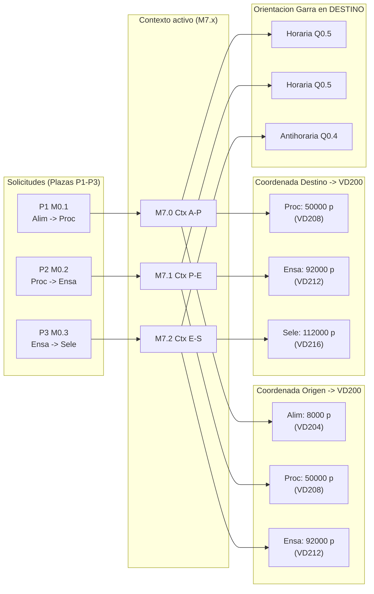

# Diagrama Red de Petri: Unidad de Transporte (CIPN)

## Leyenda
- **Circulos** = Plazas (estados estables, marcas M)
- **Rectangulos** = Transiciones (eventos que cambian el estado)
- **Flechas solidas** = Flujo de marcas
- **Flechas punteadas** = Condiciones de disparo (sensores/flags)
- `[Mx.y]` = Marca interna asociada a la plaza o transicion

---

## Diagrama Principal

```mermaid
flowchart TD

    %% =========================================================
    %% ARRANQUE
    %% =========================================================

    INIT(["SM0.1\nPrimer Scan"]):::init

    %% =========================================================
    %% ZONA 0: HOMING
    %% =========================================================

    P_Hom_Esp(["P_Hom_Espera\n[M5.0]\nEstado inicial / post-emergencia"]):::plaza_hom
    P_Hom_Act(["P_Hom_Activo\n[M5.1]\nServo buscando origen"]):::plaza_hom

    T_Hom_Ini["T_Homing_Start\n[M4.0]\nM5.0 AND M6.0 AND M3.4\n(Hom_Esp + Marcha + Servo OK)"]:::trans
    T_Hom_Done["T_Homing_Done\n[M4.1]\nM5.1 AND M3.3\n(Hom_Act + Sensor I0.0)"]:::trans

    INIT -->|"S M5.0"| P_Hom_Esp
    P_Hom_Esp --> T_Hom_Ini
    T_Hom_Ini --> P_Hom_Act
    P_Hom_Act --> T_Hom_Done

    %% =========================================================
    %% ZONA 1: REPOSO Y SOLICITUDES
    %% =========================================================

    P0(["P0 Brazo Libre\n[M0.0]\nReposo - listo para tarea"]):::plaza_ctrl
    P1(["P1 Req A-P\n[M0.1]\nSolicitud Alim -> Proc"]):::plaza_req
    P2(["P2 Req P-E\n[M0.2]\nSolicitud Proc -> Ensa"]):::plaza_req
    P3(["P3 Req E-S\n[M0.3]\nSolicitud Ensa -> Sele"]):::plaza_req

    T_Hom_Done -->|"S M0.0"| P0

    P0 -.->|"Standalone:\nM0.0 AND I2.7\nAND !M0.1..M0.3"| P1
    P0 -.->|"Modbus / HMI"| P2
    P0 -.->|"Modbus / HMI"| P3

    %% =========================================================
    %% ZONA 2: ACEPTACION DE TAREA (priorizadas)
    %% =========================================================

    T_ES["T_Acept_ES\n[M4.2]\nPRIORIDAD 1\nM0.0 AND M0.3 AND !M6.1"]:::trans_prio1
    T_PE["T_Acept_PE\n[M4.3]\nPRIORIDAD 2\nM0.0 AND M0.2 AND !M0.3 AND !M6.1"]:::trans_prio2
    T_AP["T_Acept_AP\n[M4.4]\nPRIORIDAD 3\nM0.0 AND M0.1 AND !M0.2 AND !M0.3 AND !M6.1"]:::trans_prio3

    P0 --> T_ES
    P0 --> T_PE
    P0 --> T_AP
    P3 --> T_ES
    P2 --> T_PE
    P1 --> T_AP

    %% =========================================================
    %% ZONA 3: VIAJE AL ORIGEN
    %% =========================================================

    P10(["P10 Viaje Origen\n[M1.0]\nServo -> coord recogida\nVD200 = coord estacion origen"]):::plaza_exec

    T_ES -->|"S M1.0\nS M7.2\nVD200 <- VD212 (92000p)"| P10
    T_PE -->|"S M1.0\nS M7.1\nVD200 <- VD208 (50000p)"| P10
    T_AP -->|"S M1.0\nS M7.0\nVD200 <- VD204 (8000p)"| P10

    T_Ori_OK["T_Origen_OK\n[M4.5]\nM1.0 AND M3.2\n(Viaje_Ori + Done MAP_SERV)"]:::trans
    P10 --> T_Ori_OK

    %% =========================================================
    %% ZONA 4: SECUENCIA PICK (6 pasos)
    %% =========================================================

    P11a(["P11a Rot Origen\n[M1.1]\nOrientar garra\nQ0.5 activo (H)"]):::plaza_pick
    P11b(["P11b DV Extender\n[M1.2]\nExtender doble vastago\nQ0.6 activo"]):::plaza_pick
    P11c(["P11c Bajar Brazo\n[M1.3]\nCilindro vertical baja\nQ0.3 inactivo"]):::plaza_pick
    P11d(["P11d Cerrar Pinza\n[M1.4]\nCerrar pinza\nQ1.0 activo"]):::plaza_pick
    P11e(["P11e Subir Brazo\n[M1.5]\nCilindro vertical sube\nQ0.3 activo"]):::plaza_pick
    P11f(["P11f DV Retraer\n[M1.6]\nRetraer doble vastago\nQ0.6 inactivo"]):::plaza_pick

    T_Rot_Ori["T_Rot_Ori_OK\n[M4.6]\nM1.1 AND M2.6\n(Rot_Ori + Giro H I0.6)"]:::trans
    T_DV_Ext_P["T_DV_Ext_Pick\n[M4.7]\nM1.2 AND M2.7\n(DV_Ext + Sensor I0.7)"]:::trans
    T_Cil_Baj_P["T_CilV_Baj_Pick\n[M5.2]\nM1.3 AND M2.3\n(Cil_Baj + Sensor I0.3)"]:::trans
    T_Pinza_C["T_Pinza_Cer\n[M5.3]\nM1.4 AND M3.1\n(Pinza_Cer + Sensor I1.1)"]:::trans
    T_Cil_Arr_P["T_CilV_Arr_Pick\n[M5.4]\nM1.5 AND M2.4\n(Cil_Arr + Sensor I0.4)"]:::trans
    T_DV_Ret_P["T_DV_Ret_Pick\n[M5.5]\nM1.6 AND M3.0\n(DV_Ret + Sensor I1.0)"]:::trans

    T_Ori_OK --> P11a
    P11a --> T_Rot_Ori
    T_Rot_Ori --> P11b
    P11b --> T_DV_Ext_P
    T_DV_Ext_P --> P11c
    P11c --> T_Cil_Baj_P
    T_Cil_Baj_P --> P11d
    P11d --> T_Pinza_C
    T_Pinza_C --> P11e
    P11e --> T_Cil_Arr_P
    T_Cil_Arr_P --> P11f
    P11f --> T_DV_Ret_P

    %% =========================================================
    %% ZONA 5: ORIENTACION DESTINO + VIAJE AL DESTINO
    %% =========================================================

    P13a(["P13a Rot Destino\n[M2.0]\nOrientar garra segun contexto\nQ0.5(H) o Q0.4(AH)"]):::plaza_place

    T_Rot_Des["T_Rot_Des_OK\n[M5.7]\nM2.0 AND\n((M2.6 AND !M7.2) OR (M2.5 AND M7.2))\nH para A-P/P-E, AH para E-S"]:::trans

    T_DV_Ret_P -->|"S M2.0"| P13a
    P13a --> T_Rot_Des

    P12(["P12 Viaje Destino\n[M1.7]\nServo -> coord entrega\nVD200 = coord estacion destino"]):::plaza_exec
    T_Des_OK["T_Destino_OK\n[M5.6]\nM1.7 AND M3.2\n(Viaje_Des + Done MAP_SERV)"]:::trans

    T_Rot_Des -->|"S M1.7\nVD200 <- coord segun M7.x\nM7.0: VD208\nM7.1: VD212\nM7.2: VD216"| P12
    P12 --> T_Des_OK

    %% =========================================================
    %% ZONA 6: SECUENCIA PLACE (5 pasos)
    %% =========================================================

    P13b(["P13b DV Extender\n[M2.1]\nExtender doble vastago\nQ0.6 activo"]):::plaza_place
    P13c(["P13c Bajar Brazo\n[M2.2]\nCilindro vertical baja\nQ0.3 inactivo"]):::plaza_place
    P13d(["P13d Abrir Pinza\n[M8.0]\nAbrir pinza\nQ0.7 activo"]):::plaza_place
    P13e(["P13e Subir Brazo\n[M8.1]\nCilindro vertical sube\nQ0.3 activo"]):::plaza_place
    P13f(["P13f DV Retraer\n[M3.5]\nRetraer doble vastago\nQ0.6 inactivo"]):::plaza_place

    T_DV_Ext_L["T_DV_Ext_Place\n[M6.2]\nM2.1 AND M2.7\n(DV_Ext + Sensor I0.7)"]:::trans
    T_Cil_Baj_L["T_CilV_Baj_Place\n[M6.3]\nM2.2 AND M2.3\n(Cil_Baj + Sensor I0.3)"]:::trans
    T_Pinza_A["T_Pinza_Ab\n[M6.4]\nM8.0 AND !M3.1\n(Pinza_Ab + !Sensor I1.1)"]:::trans
    T_Cil_Arr_L["T_CilV_Arr_Place\n[M6.5]\nM8.1 AND M2.4\n(Cil_Arr + Sensor I0.4)"]:::trans
    T_DV_Ret_L["T_DV_Ret_Place\n[M6.6]\nM3.5 AND M3.0\n(DV_Ret + Sensor I1.0)"]:::trans

    T_Des_OK --> P13b
    P13b --> T_DV_Ext_L
    T_DV_Ext_L --> P13c
    P13c --> T_Cil_Baj_L
    T_Cil_Baj_L --> P13d
    P13d --> T_Pinza_A
    T_Pinza_A --> P13e
    P13e --> T_Cil_Arr_L
    T_Cil_Arr_L --> P13f
    P13f --> T_DV_Ret_L

    %% =========================================================
    %% ZONA 7: FINALIZACION
    %% =========================================================

    P14(["P14 Finalizar\n[M3.6]\nLimpiar solicitud y contexto\nLiberar brazo (S M0.0)"]):::plaza_exec
    T_Fin["T_Tarea_Fin\n[M6.7]\nM3.6\n(sin condicion adicional)"]:::trans

    T_DV_Ret_L --> P14
    P14 --> T_Fin
    T_Fin -->|"S M0.0\nR M0.x solicitud\nR M7.0,3 contexto"| P0

    %% =========================================================
    %% EMERGENCIA
    %% =========================================================

    EMERG(["EMERGENCIA\nI2.6 = 0\nSeta activa"]):::emerg

    EMERG -.->|"R M0.1..M0.3\nR M1.0..M1.6\nR M2.0..M2.2\nR M8.0 M8.1\nR M3.5 M3.6\nR Q0.3..Q1.0\nS M5.0"| P_Hom_Esp

    %% =========================================================
    %% ESTILOS
    %% =========================================================

    classDef plaza_hom    fill:#f5d0fe,stroke:#a855f7,stroke-width:2px,color:#000
    classDef plaza_ctrl   fill:#bbf7d0,stroke:#16a34a,stroke-width:3px,color:#000
    classDef plaza_req    fill:#e0f2fe,stroke:#0284c7,stroke-width:2px,color:#000
    classDef plaza_exec   fill:#fef9c3,stroke:#ca8a04,stroke-width:2px,color:#000
    classDef plaza_pick   fill:#fed7aa,stroke:#ea580c,stroke-width:2px,color:#000
    classDef plaza_place  fill:#dbeafe,stroke:#2563eb,stroke-width:2px,color:#000
    classDef trans        fill:#1e293b,stroke:#475569,stroke-width:1px,color:#fff
    classDef trans_prio1  fill:#991b1b,stroke:#fca5a5,stroke-width:2px,color:#fff
    classDef trans_prio2  fill:#92400e,stroke:#fcd34d,stroke-width:2px,color:#fff
    classDef trans_prio3  fill:#14532d,stroke:#86efac,stroke-width:2px,color:#fff
    classDef init         fill:#e2e8f0,stroke:#64748b,stroke-width:1px,color:#000,stroke-dasharray:4
    classDef emerg        fill:#450a0a,stroke:#f87171,stroke-width:3px,color:#fff
```

---

## Mapa de Contexto de Tarea

Cuando se acepta una solicitud, el sistema guarda el contexto activo en **M7.0 / M7.1 / M7.2**. Estas marcas determinan las coordenadas y la orientacion de la garra.

---

## Tabla de Plazas (referencia rapida)

| Plaza | Marca | Zona | Descripcion | Salidas Q activas |
|:---|:---|:---|:---|:---|
| P_Hom_Espera | M5.0 | Homing | Arranque / post-emergencia | Q0.3 (brazo arriba) |
| P_Hom_Activo | M5.1 | Homing | Servo buscando origen | Q0.3 (brazo arriba) |
| **P0 Brazo Libre** | **M0.0** | **Ctrl** | **Reposo, listo** | Q1.7 (roja) |
| P1 Req A-P | M0.1 | Solicitudes | Solicitud pendiente A->P | — |
| P2 Req P-E | M0.2 | Solicitudes | Solicitud pendiente P->E | — |
| P3 Req E-S | M0.3 | Solicitudes | Solicitud pendiente E->S | — |
| P10 Viaje Origen | M1.0 | Ejecucion | Servo en movimiento a recogida | Q0.3, Q1.6 |
| P11a Rot Origen | M1.1 | Pick | Orientar garra (horaria) | Q0.3, Q0.5, Q0.7, Q1.6 |
| P11b DV Extender | M1.2 | Pick | Extender doble vastago | Q0.3, Q0.5, Q0.6, Q0.7, Q1.6 |
| P11c Bajar Brazo | M1.3 | Pick | Bajar brazo (Q0.3 inactivo) | Q0.5, Q0.6, Q0.7, Q1.6 |
| P11d Cerrar Pinza | M1.4 | Pick | Cerrar pinza | Q0.6, Q1.0, Q1.6 |
| P11e Subir Brazo | M1.5 | Pick | Subir con pieza | Q0.3, Q0.6, Q1.0, Q1.6 |
| P11f DV Retraer | M1.6 | Pick | Retraer doble vastago | Q0.3, Q1.0, Q1.6 |
| P13a Rot Destino | M2.0 | Orientacion | Orientar segun contexto | Q0.3, Q0.4 o Q0.5, Q1.0, Q1.6 |
| P12 Viaje Destino | M1.7 | Ejecucion | Servo en movimiento a entrega | Q0.3, Q1.0, Q1.6 |
| P13b DV Extender | M2.1 | Place | Extender doble vastago | Q0.3, Q0.5, Q0.6, Q1.0, Q1.6 |
| P13c Bajar Brazo | M2.2 | Place | Bajar brazo (Q0.3 inactivo) | Q0.5, Q0.6, Q1.0, Q1.6 |
| P13d Abrir Pinza | M8.0 | Place | Abrir pinza | Q0.6, Q0.7, Q1.6 |
| P13e Subir Brazo | M8.1 | Place | Subir tras soltar | Q0.3, Q0.7, Q1.6 |
| P13f DV Retraer | M3.5 | Place | Retraer doble vastago | Q0.3, Q0.7, Q1.6 |
| P14 Finalizar | M3.6 | Ejecucion | Limpiar y liberar brazo | Q0.3, Q1.6 |

---

## Tabla de Transiciones (referencia rapida)

| Transicion | Marca | Condicion (AWL) | Accion principal |
|:---|:---|:---|:---|
| T_Homing_Start | M4.0 | M5.0 AND M6.0 AND M3.4 | R M5.0, S M5.1 |
| T_Homing_Done | M4.1 | M5.1 AND M3.3 | R M5.1, S M0.0 |
| T_Acept_ES | M4.2 | M0.0 AND M0.3 AND !M6.1 | R M0.0, S M1.0, S M7.2, VD200<-VD212 |
| T_Acept_PE | M4.3 | M0.0 AND M0.2 AND !M0.3 AND !M6.1 | R M0.0, S M1.0, S M7.1, VD200<-VD208 |
| T_Acept_AP | M4.4 | M0.0 AND M0.1 AND !M0.2 AND !M0.3 AND !M6.1 | R M0.0, S M1.0, S M7.0, VD200<-VD204 |
| T_Origen_OK | M4.5 | M1.0 AND M3.2 | R M1.0, S M1.1 |
| T_Rot_Ori_OK | M4.6 | M1.1 AND M2.6 | R M1.1, S M1.2 |
| T_DV_Ext_Pick | M4.7 | M1.2 AND M2.7 | R M1.2, S M1.3 |
| T_CilV_Baj_Pick | M5.2 | M1.3 AND M2.3 | R M1.3, S M1.4 |
| T_Pinza_Cer | M5.3 | M1.4 AND M3.1 | R M1.4, S M1.5 |
| T_CilV_Arr_Pick | M5.4 | M1.5 AND M2.4 | R M1.5, S M1.6 |
| T_DV_Ret_Pick | M5.5 | M1.6 AND M3.0 | R M1.6, S M2.0 |
| T_Rot_Des_OK | M5.7 | M2.0 AND (Giro H si !M7.2, Giro AH si M7.2) | R M2.0, S M1.7, VD200<-coord destino |
| T_Destino_OK | M5.6 | M1.7 AND M3.2 | R M1.7, S M2.1 |
| T_DV_Ext_Place | M6.2 | M2.1 AND M2.7 | R M2.1, S M2.2 |
| T_CilV_Baj_Place | M6.3 | M2.2 AND M2.3 | R M2.2, S M8.0 |
| T_Pinza_Ab | M6.4 | M8.0 AND !M3.1 | R M8.0, S M8.1 |
| T_CilV_Arr_Place | M6.5 | M8.1 AND M2.4 | R M8.1, S M3.5 |
| T_DV_Ret_Place | M6.6 | M3.5 AND M3.0 | R M3.5, S M3.6 |
| T_Tarea_Fin | M6.7 | M3.6 | R M3.6, S M0.0, R M7.0,3, R M0.x solicitud |
