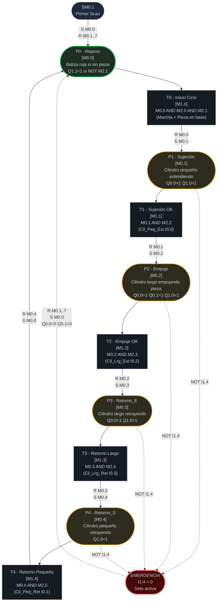
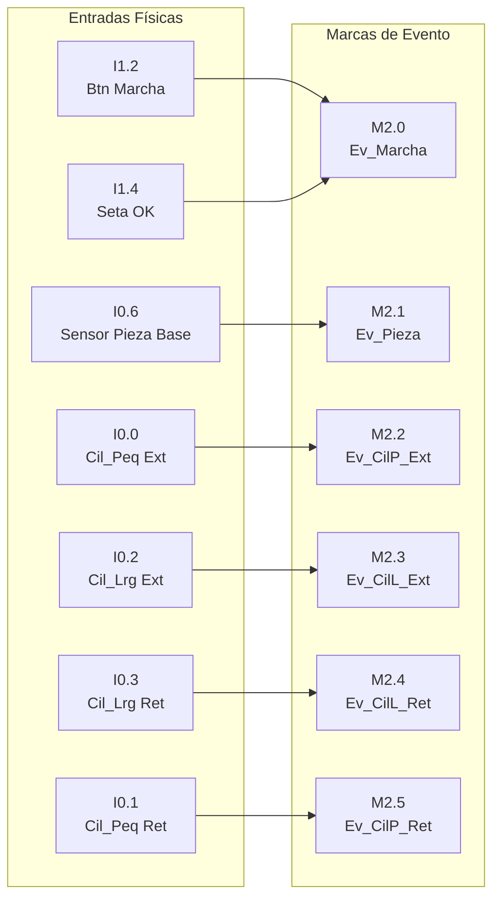

# Diagrama Red de Petri: Unidad de Alimentación (CIPN)
## Sistema de Manufactura Flexible XK335B | S7-200 CPU 224XP CN
### Estación 2 — Alimentación | Versión 4.0

---

## Leyenda
- **Círculos / Óvalos** = Plazas (estados estables, portadoras de marcas M)
- **Rectángulos** = Transiciones (eventos que cambian el estado)
- **Flechas sólidas** = Flujo de marcas
- **Flechas punteadas** = Condición de emergencia
- `[Mx.y]` = Marca de memoria interna asociada

---

## Diagrama Principal

---

## Mapa de Eventos (Entradas Físicas → Marcas Internas)

---

## Tabla de Plazas (referencia rápida)

| Plaza | Marca | Nombre | Descripción | Salidas Q activas |
|:---|:---|:---|:---|:---|
| **P0** | **M0.0** | **Reposo** | **Estado inicial / post-emergencia** | **Q1.1 si NOT M2.1** |
| P1 | M0.1 | Sujeción | Cilindro pequeño extendiendo (sujeta columna) | Q0.0, Q1.0 |
| P2 | M0.2 | Empuje | Cilindro largo empuja pieza hacia salida | Q0.0, Q0.1, Q1.0 |
| P3 | M0.3 | Retorno_E | Cilindro largo retrayendo | Q0.0, Q1.0 |
| P4 | M0.4 | Retorno_S | Cilindro pequeño retrayendo | Q1.0 |

---

## Tabla de Transiciones (referencia rápida)

| Transición | Marca | Condición (AWL) | Acción principal |
|:---|:---|:---|:---|
| T0 | M1.0 | M0.0 AND M2.0 AND M2.1 | R M0.0, S M0.1 |
| T1 | M1.1 | M0.1 AND M2.2 | R M0.1, S M0.2 |
| T2 | M1.2 | M0.2 AND M2.3 | R M0.2, S M0.3 |
| T3 | M1.3 | M0.3 AND M2.4 | R M0.3, S M0.4 |
| T4 | M1.4 | M0.4 AND M2.5 | R M0.4, S M0.0 |

---

## Tabla de Eventos (referencia rápida)

| Evento | Marca | Entradas físicas | Descripción |
|:---|:---|:---|:---|
| Ev_Marcha | M2.0 | I1.2 AND I1.4 | Marcha válida: botón verde Y seta OK |
| Ev_Pieza | M2.1 | I0.6 | Pieza presente en base del tubo almacén |
| Ev_CilP_Ext | M2.2 | I0.0 | Cilindro pequeño: posición extendida confirmada |
| Ev_CilL_Ext | M2.3 | I0.2 | Cilindro largo: posición extendida confirmada |
| Ev_CilL_Ret | M2.4 | I0.3 | Cilindro largo: posición retraída confirmada |
| Ev_CilP_Ret | M2.5 | I0.1 | Cilindro pequeño: posición retraída confirmada |

---

## Comportamiento de Emergencia

| Condición | Acción AWL | Efecto en el sistema |
|:---|:---|:---|
| I1.4 = 0 (seta pulsada) | JMP inicio MOD — omite asignación de salidas | Q0.0=0, Q0.1=0 (cilindros se detienen) |
| I1.4 = 0 en bloque EMERG | R M0.1..7, S M0.0 | Resetea plazas P1–P4, activa P0 (Reposo) |
| Señal Q1.1 en emergencia | NOT I1.4 en condición | Baliza roja activa |
| Recuperación | Liberar seta (I1.4 → 1) | Sistema en P0, listo para nuevo ciclo |

---

## Marcado Inicial (Primer Scan)

Condición: SM0.1 = 1 (solo el primer ciclo de scan del PLC)

| Operación | Efecto |
|:---|:---|
| S M0.0, 1 | Activa P0 (marca inicial de la Red de Petri) |
| R M0.1, 7 | Garantiza que P1..P4 (y M0.5..M0.7) estén en 0 |

El sistema siempre arranca en estado **P0 (Reposo)** con todas las salidas inactivas.
