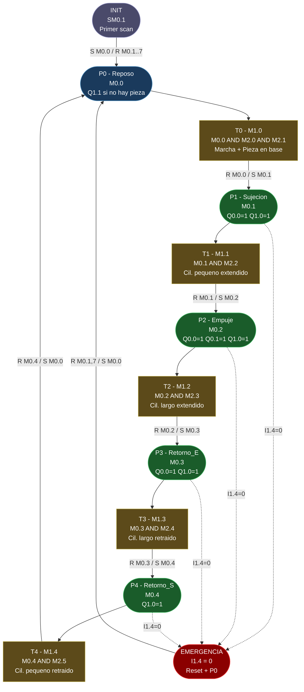

# Unidad de Alimentacion - Diagrama de la Red de Petri (CIPN)
## Sistema de Manufactura Flexible XK335B | S7-200 CPU 224XP CN
### Documento: 5 de 5 | Version: 4.0

---

## 1. Diagrama de la Red de Petri (Flowchart)

El diagrama representa el modelo CIPN completo de la Unidad de Alimentacion.
Los nodos de plaza (rectangulos redondeados) muestran la marca de memoria asociada.
Los nodos de transicion (rectangulos) muestran la condicion logica de disparo.
Se incluye el nodo de inicializacion (SM0.1) y el nodo de emergencia (I1.4=0).

---

## 2. Tabla de Plazas

| Plaza | Marca  | Nombre       | Acciones de salida activas                        | Condicion de salida especial      |
|-------|--------|--------------|---------------------------------------------------|-----------------------------------|
| P0    | M0.0   | Reposo       | Q1.1=1 si (NOT M2.1) | Sin I1.4: Q1.1=1   | Lampara roja: espera pieza o emerg.|
| P1    | M0.1   | Sujecion     | Q0.0=1, Q1.0=1                                    | Cil. pequeno extendiendo           |
| P2    | M0.2   | Empuje       | Q0.0=1, Q0.1=1, Q1.0=1                            | Cil. largo empujando pieza         |
| P3    | M0.3   | Retorno_E    | Q0.0=1, Q1.0=1                                    | Cil. largo retraendo               |
| P4    | M0.4   | Retorno_S    | Q1.0=1                                            | Cil. pequeno retraendo             |

---

## 3. Tabla de Transiciones

| Trans. | Marca  | Plaza origen | Condicion de disparo           | Plaza destino | Evento fisico              |
|--------|--------|--------------|--------------------------------|---------------|----------------------------|
| T0     | M1.0   | P0 (M0.0)    | M2.0 AND M2.1                  | P1 (M0.1)     | Btn_Marcha + Presencia_Inf |
| T1     | M1.1   | P1 (M0.1)    | M2.2                           | P2 (M0.2)     | Cil_Peq_Ext (I0.0)         |
| T2     | M1.2   | P2 (M0.2)    | M2.3                           | P3 (M0.3)     | Cil_Lrg_Ext (I0.2)         |
| T3     | M1.3   | P3 (M0.3)    | M2.4                           | P4 (M0.4)     | Cil_Lrg_Ret (I0.3)         |
| T4     | M1.4   | P4 (M0.4)    | M2.5                           | P0 (M0.0)     | Cil_Peq_Ret (I0.1)         |

---

## 4. Tabla de Eventos

| Evento | Marca  | Entradas fisicas | Descripcion                                      |
|--------|--------|------------------|--------------------------------------------------|
| Ev_Marcha   | M2.0 | I1.2 AND I1.4  | Marcha valida: boton verde Y seta OK           |
| Ev_Pieza    | M2.1 | I0.6           | Pieza en base del tubo (sensor inferior)       |
| Ev_CilP_Ext | M2.2 | I0.0           | Cil. pequeno: posicion extendida confirmada    |
| Ev_CilL_Ext | M2.3 | I0.2           | Cil. largo: posicion extendida confirmada      |
| Ev_CilL_Ret | M2.4 | I0.3           | Cil. largo: posicion retraida confirmada       |
| Ev_CilP_Ret | M2.5 | I0.1           | Cil. pequeno: posicion retraida confirmada     |

---

## 5. Comportamiento de Emergencia

El arco de emergencia (linea punteada en el diagrama) aplica a cualquier plaza activa
durante la operacion normal (P1, P2, P3, P4). Tambien puede aplicar a P0 si I1.4 cae.

| Condicion        | Accion en AWL             | Efecto en el sistema                          |
|------------------|---------------------------|-----------------------------------------------|
| I1.4 = 0         | JMP 0 (inicio MOD5)       | Omite asignacion de salidas: Q0.0=0, Q0.1=0  |
| I1.4 = 0 en LBL0 | R M0.1,7 + S M0.0,1       | Resetea plazas P1-P7, activa P0 (Reposo)     |
| Q1.1 logica      | NOT I1.4 en condicion     | Lampara roja activa en emergencia             |
| Recuperacion     | Liberar seta (I1.4 -> 1)  | Sistema en P0, listo para nuevo ciclo        |

---

## 6. Marcado Inicial (Primer Scan)

Condicion: SM0.1 = 1 (solo el primer ciclo de scan del PLC)

| Operacion    | Efecto                                          |
|--------------|-------------------------------------------------|
| S M0.0, 1    | Activa P0 (marca inicial de la Red de Petri)    |
| R M0.1, 7    | Garantiza que P1..P4 (y M0.5..M0.7) esten a 0 |

El sistema siempre arranca en estado P0 (Reposo) con todas las salidas inactivas.
