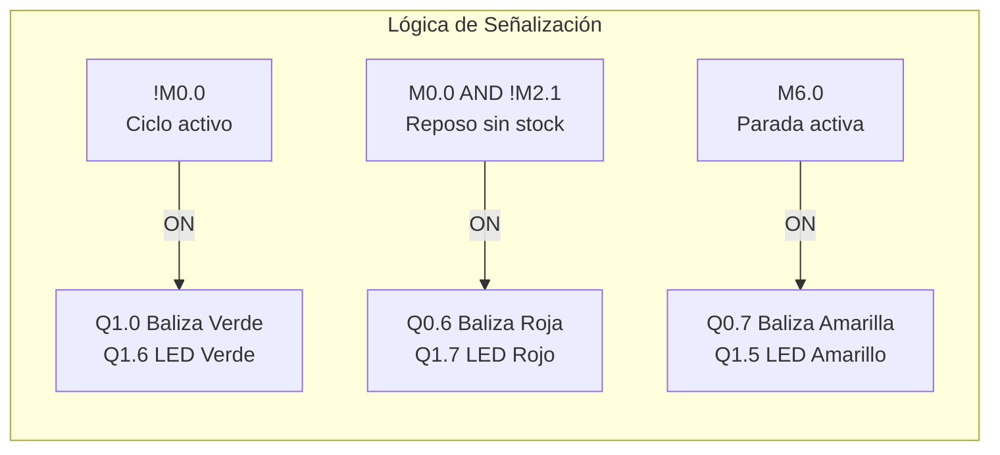

# Diagrama Red de Petri: Unidad de Ensamblaje (CIPN)
## Sistema de Manufactura Flexible XK335B | S7-200 CPU 224XP CN
### Estación 3 — Ensamblaje | Versión 4.0

---

## Leyenda
- **Círculos / Óvalos** = Plazas (estados estables, portadoras de marcas M)
- **Rectángulos** = Transiciones (eventos que cambian el estado)
- **Flechas sólidas** = Flujo de marcas
- **Flechas punteadas** = Condición de emergencia
- `[Mx.y]` = Marca de memoria interna asociada

---

## Diagrama Principal

```mermaid
flowchart TD

    %% =========================================================
    %% ARRANQUE
    %% =========================================================

    INIT(["SM0.1\nPrimer Scan"]):::init

    %% =========================================================
    %% ZONA 0: REPOSO
    %% =========================================================

    P0(["P0 - Reposo\n[M0.0]\nEspera condiciones de inicio\nQ0.0 activo (lógica invertida)"]):::plaza_ctrl

    INIT -->|"S M0.0\nR M0.1..M1.7\nR Q0.0..Q0.5"| P0

    %% =========================================================
    %% ZONA 1: SUBSECUENCIA DOSIFICADOR (3 pasos)
    %% =========================================================

    P1(["P1 - Dos_Sujetar\n[M0.1]\nCil. superior extiende (sujeta columna)\nQ0.0=1 Q0.1=1"]):::plaza_exec
    P2(["P2 - Dos_Caída\n[M0.2]\nCil. inferior retrae (libera pieza)\nQ0.1=1 (Q0.0=OFF)"]):::plaza_exec
    P3(["P3 - Dos_Restaurar\n[M0.3]\nCil. inferior extiende (restaura posición)\nQ0.0=1 Q0.1=1"]):::plaza_exec

    T0["T0 - Inicio Ciclo\n[M4.0]\nM0.0 AND M2.0 AND M2.1\nAND M2.2 AND !M6.0\n(Marcha + Stock + Sin parada)"]:::trans
    T1["T1 - Sujetador OK\n[M4.1]\nM0.1 AND M2.3\n(CilS_Ext I0.x)"]:::trans
    T2["T2 - Pieza Liberada\n[M4.2]\nM0.2 AND M2.6\n(CilI_Ret I0.x)"]:::trans
    T3["T3 - Dosificador Restaurado\n[M4.3]\nM0.3 AND M2.5\n(CilI_Ext I0.x)"]:::trans

    P0 --> T0
    T0 -->|"R M0.0\nS M0.1"| P1
    P1 --> T1
    T1 -->|"R M0.1\nS M0.2"| P2
    P2 --> T2
    T2 -->|"R M0.2\nS M0.3"| P3
    P3 --> T3

    %% =========================================================
    %% ZONA 2: MESA GIRATORIA (1 paso)
    %% =========================================================

    P4(["P4 - Mesa_Giro\n[M0.4]\nGira mesa antihorario a posición de recogida\nQ0.0=1 Q0.2=1"]):::plaza_exec

    T4["T4 - Mesa en Posición\n[M4.4]\nM0.4 AND M3.0\n(Giro_H sensor I0.x)"]:::trans

    T3 -->|"R M0.3\nS M0.4"| P4
    P4 --> T4

    %% =========================================================
    %% ZONA 3: SUBSECUENCIA PICK (3 pasos)
    %% =========================================================

    P5(["P5 - Pick_Bajar\n[M0.5]\nBrazo desciende sobre pieza secundaria\nQ0.0=1 Q0.2=1 Q0.4=1"]):::plaza_pick
    P6(["P6 - Pick_Agarrar\n[M0.6]\nPinza cierra para agarrar pieza\nQ0.0=1 Q0.2=1 Q0.3=1 Q0.4=1"]):::plaza_pick
    P7(["P7 - Pick_Subir\n[M0.7]\nBrazo asciende con pieza agarrada\nQ0.0=1 Q0.2=1 Q0.3=1"]):::plaza_pick

    T5["T5 - Brazo Abajo (Pick)\n[M4.5]\nM0.5 AND M3.2\n(CilV_Abajo I0.x)"]:::trans
    T6["T6 - Pinza Cerrada OK\n[M4.6]\nM0.6 AND M3.1\n(Pinza_Cer I0.x)"]:::trans
    T7["T7 - Subida Pick\n[M4.7]\nM0.7\n(Subida instantánea)"]:::trans

    T4 -->|"R M0.4\nS M0.5"| P5
    P5 --> T5
    T5 -->|"R M0.5\nS M0.6"| P6
    P6 --> T6
    T6 -->|"R M0.6\nS M0.7"| P7
    P7 --> T7

    %% =========================================================
    %% ZONA 4: SUBSECUENCIA PLACE (4 pasos)
    %% =========================================================

    P8(["P8 - Place_Trans\n[M1.0]\nBrazo se traslada horizontalmente\nQ0.0=1 Q0.3=1 Q0.5=1"]):::plaza_place
    P9(["P9 - Place_Bajar\n[M1.1]\nBrazo desciende sobre pieza receptora\nQ0.0=1 Q0.3=1 Q0.4=1 Q0.5=1"]):::plaza_place
    P10(["P10 - Place_Soltar\n[M1.2]\nPinza abre y suelta la pieza\nQ0.0=1 Q0.4=1 Q0.5=1"]):::plaza_place
    P11(["P11 - Place_Subir\n[M1.3]\nBrazo asciende tras depositar pieza\nQ0.0=1 Q0.5=1"]):::plaza_place

    T8["T8 - Brazo Adelante OK\n[M5.0]\nM1.0 AND M3.5\n(CilH_Adel I0.x)"]:::trans
    T9["T9 - Brazo Abajo (Place)\n[M5.1]\nM1.1 AND M3.2\n(CilV_Abajo I0.x)"]:::trans
    T10["T10 - Pinza Abierta\n[M5.2]\nM1.2 AND !M3.1\n(!Pinza_Cer I0.x)"]:::trans
    T11["T11 - Subida Place\n[M5.3]\nM1.3\n(Subida instantánea)"]:::trans

    T7 -->|"R M0.7\nS M1.0"| P8
    P8 --> T8
    T8 -->|"R M1.0\nS M1.1"| P9
    P9 --> T9
    T9 -->|"R M1.1\nS M1.2"| P10
    P10 --> T10
    T10 -->|"R M1.2\nS M1.3"| P11
    P11 --> T11

    %% =========================================================
    %% ZONA 5: RETORNO Y RESET
    %% =========================================================

    P12(["P12 - Reset_Arm\n[M1.4]\nBrazo retorna atrás, mesa a origen\nQ0.0=1"]):::plaza_exec

    T12["T12 - Retorno Completo\n[M5.4]\nM1.4 AND M3.4 AND M3.0\n(CilH_Atras Y Mesa en origen)"]:::trans

    T11 -->|"R M1.3\nS M1.4"| P12
    P12 --> T12
    T12 -->|"R M1.4\nS M0.0"| P0

    %% =========================================================
    %% EMERGENCIA
    %% =========================================================

    EMERG(["EMERGENCIA\nI2.6 = 0\nSeta activa"]):::emerg

    P1 -.->|"NOT I2.6"| EMERG
    P2 -.->|"NOT I2.6"| EMERG
    P3 -.->|"NOT I2.6"| EMERG
    P4 -.->|"NOT I2.6"| EMERG
    P5 -.->|"NOT I2.6"| EMERG
    P6 -.->|"NOT I2.6"| EMERG
    P7 -.->|"NOT I2.6"| EMERG
    P8 -.->|"NOT I2.6"| EMERG
    P9 -.->|"NOT I2.6"| EMERG
    P10 -.->|"NOT I2.6"| EMERG
    P11 -.->|"NOT I2.6"| EMERG
    P12 -.->|"NOT I2.6"| EMERG
    EMERG -.->|"R M0.1..M1.7\nS M0.0\nR Q0.0..Q0.5"| P0

    %% =========================================================
    %% ESTILOS
    %% =========================================================

    classDef plaza_ctrl   fill:#1f2e24,stroke:#16a34a,stroke-width:3px,color:#c9d1d9
    classDef plaza_exec   fill:#2e2c1f,stroke:#ca8a04,stroke-width:2px,color:#c9d1d9
    classDef plaza_pick   fill:#2e251f,stroke:#ea580c,stroke-width:2px,color:#c9d1d9
    classDef plaza_place  fill:#1f242e,stroke:#2563eb,stroke-width:2px,color:#c9d1d9
    classDef trans        fill:#161b22,stroke:#475569,stroke-width:1px,color:#c9d1d9
    classDef init         fill:#1e293b,stroke:#64748b,stroke-width:1px,color:#c9d1d9,stroke-dasharray:4
    classDef emerg        fill:#450a0a,stroke:#f87171,stroke-width:3px,color:#c9d1d9
```

---

## Diagrama de Señalización

---

## Tabla de Plazas (referencia rápida)

| Plaza | Marca | Zona | Nombre | Descripción | Salidas Q activas |
|:---|:---|:---|:---|:---|:---|
| **P0** | **M0.0** | **Ctrl** | **Reposo** | **Estado inicial / post-emergencia** | **Q0.0 (inv.)** |
| P1 | M0.1 | Dosificador | Dos_Sujetar | Extiende cilindro superior (sujeta columna) | Q0.0, Q0.1 |
| P2 | M0.2 | Dosificador | Dos_Caída | Retrae cilindro inferior (libera pieza) | Q0.1 (Q0.0=OFF) |
| P3 | M0.3 | Dosificador | Dos_Restaurar | Extiende cilindro inferior (restaura) | Q0.0, Q0.1 |
| P4 | M0.4 | Mesa | Mesa_Giro | Gira mesa antihorario a posición de recogida | Q0.0, Q0.2 |
| P5 | M0.5 | Pick | Pick_Bajar | Baja brazo sobre pieza secundaria | Q0.0, Q0.2, Q0.4 |
| P6 | M0.6 | Pick | Pick_Agarrar | Cierra pinza para agarrar pieza | Q0.0, Q0.2, Q0.3, Q0.4 |
| P7 | M0.7 | Pick | Pick_Subir | Sube brazo con pieza agarrada | Q0.0, Q0.2, Q0.3 |
| P8 | M1.0 | Place | Place_Trans | Traslada brazo horizontalmente | Q0.0, Q0.3, Q0.5 |
| P9 | M1.1 | Place | Place_Bajar | Baja brazo sobre pieza receptora | Q0.0, Q0.3, Q0.4, Q0.5 |
| P10 | M1.2 | Place | Place_Soltar | Abre pinza y suelta pieza | Q0.0, Q0.4, Q0.5 |
| P11 | M1.3 | Place | Place_Subir | Sube brazo tras depositar pieza | Q0.0, Q0.5 |
| P12 | M1.4 | Reset | Reset_Arm | Retorna brazo atrás, mesa a origen | Q0.0 |

---

## Tabla de Transiciones (referencia rápida)

| Transición | Marca | Condición (AWL) | Acción principal |
|:---|:---|:---|:---|
| T0 | M4.0 | M0.0 AND M2.0 AND M2.1 AND M2.2 AND !M6.0 | R M0.0, S M0.1 |
| T1 | M4.1 | M0.1 AND M2.3 | R M0.1, S M0.2 |
| T2 | M4.2 | M0.2 AND M2.6 | R M0.2, S M0.3 |
| T3 | M4.3 | M0.3 AND M2.5 | R M0.3, S M0.4 |
| T4 | M4.4 | M0.4 AND M3.0 | R M0.4, S M0.5 |
| T5 | M4.5 | M0.5 AND M3.2 | R M0.5, S M0.6 |
| T6 | M4.6 | M0.6 AND M3.1 | R M0.6, S M0.7 |
| T7 | M4.7 | M0.7 | R M0.7, S M1.0 |
| T8 | M5.0 | M1.0 AND M3.5 | R M1.0, S M1.1 |
| T9 | M5.1 | M1.1 AND M3.2 | R M1.1, S M1.2 |
| T10 | M5.2 | M1.2 AND !M3.1 | R M1.2, S M1.3 |
| T11 | M5.3 | M1.3 | R M1.3, S M1.4 |
| T12 | M5.4 | M1.4 AND M3.4 AND M3.0 | R M1.4, S M0.0 |

---

## Marcado Inicial (Primer Scan)

Condición: SM0.1 = 1 (solo el primer ciclo de scan del PLC)

| Operación | Efecto |
|:---|:---|
| S M0.0, 1 | Activa P0 (marca inicial de la Red de Petri) |
| R M0.1..M1.7 | Garantiza que todas las plazas P1–P12 estén en 0 |
| R Q0.0..Q0.5 | Garantiza que todas las salidas físicas estén inactivas |

El sistema siempre arranca en estado **P0 (Reposo)** con todas las salidas inactivas.
