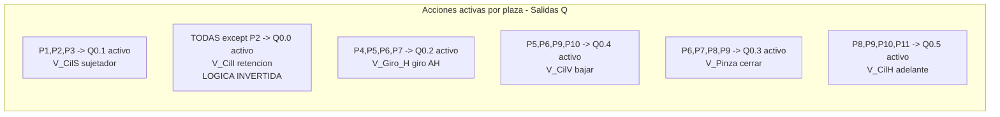
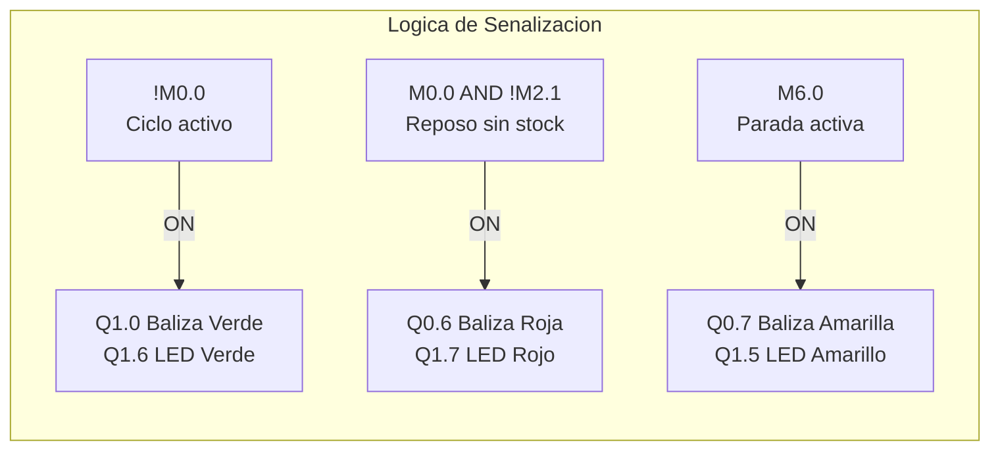

# Unidad de Ensamblaje - XK335B | S7-200 CPU 224XP CN
# Documento 4: Diagrama de la Red de Petri (CIPN)
# OB1 UNIDAD DE ENSAMBLAJE v2 - CIPN

---

## 1. Diagrama Mermaid - Flowchart TD

```mermaid
flowchart TD

    INIT([INICIO / SM0.1]):::init
    EMERG([EMERGENCIA\nI2.6=0]):::emerg

    INIT -->|"S M0.0"| P0

    EMERG -->|"R M0.1..M1.7\nS M0.0\nR Q0.0..Q0.5"| P0

    subgraph DOS["Subsecuencia Dosificador"]
        P0(["P0 - Reposo\nM0.0"]):::plaza
        P1(["P1 - Dos_Sujetar\nM0.1"]):::plaza
        P2(["P2 - Dos_Caida\nM0.2"]):::plaza
        P3(["P3 - Dos_Restaurar\nM0.3"]):::plaza

        T0{"T0\nM2.0 AND M2.1\nAND M2.2\nAND !M6.0"}:::trans
        T1{"T1\nM2.3\nCilS_Ext OK"}:::trans
        T2{"T2\nM2.6\nCilI_Ret OK"}:::trans
        T3{"T3\nM2.5\nCilI_Ext OK"}:::trans

        P0 --> T0 --> P1
        P1 --> T1 --> P2
        P2 --> T2 --> P3
        P3 --> T3
    end

    subgraph MESA["Subsecuencia Mesa Giratoria"]
        P4(["P4 - Mesa_Giro\nM0.4"]):::plaza
        T4{"T4\nM3.0\nGiro_H OK"}:::trans
        T3 --> P4
        P4 --> T4
    end

    subgraph PICK["Subsecuencia Pick"]
        P5(["P5 - Pick_Bajar\nM0.5"]):::plaza
        P6(["P6 - Pick_Agarrar\nM0.6"]):::plaza
        P7(["P7 - Pick_Subir\nM0.7"]):::plaza

        T5{"T5\nM3.2\nCilV_Abajo"}:::trans
        T6{"T6\nM3.1\nPinza_Cer"}:::trans
        T7{"T7\nSolo P7\nactivo"}:::trans

        T4 --> P5
        P5 --> T5 --> P6
        P6 --> T6 --> P7
        P7 --> T7
    end

    subgraph PLACE["Subsecuencia Place"]
        P8(["P8 - Place_Trans\nM1.0"]):::plaza
        P9(["P9 - Place_Bajar\nM1.1"]):::plaza
        P10(["P10 - Place_Soltar\nM1.2"]):::plaza
        P11(["P11 - Place_Subir\nM1.3"]):::plaza

        T8{"T8\nM3.5\nCilH_Adel"}:::trans
        T9{"T9\nM3.2\nCilV_Abajo"}:::trans
        T10{"T10\n!M3.1\nPinza_Abr"}:::trans
        T11{"T11\nSolo P11\nactivo"}:::trans

        T7 --> P8
        P8 --> T8 --> P9
        P9 --> T9 --> P10
        P10 --> T10 --> P11
        P11 --> T11
    end

    subgraph RESET["Retorno y Reset"]
        P12(["P12 - Reset_Arm\nM1.4"]):::plaza
        T12{"T12\nM3.4 AND M3.0\nCilH_Atras\nAND Giro_H"}:::trans
        T11 --> P12
        P12 --> T12
    end

    T12 -->|"Token\nvuelve a P0"| P0

    classDef plaza fill:#1a6b9a,stroke:#0d4f75,color:#ffffff,rx:10
    classDef trans fill:#c47a00,stroke:#8a5500,color:#ffffff
    classDef init fill:#2d7a3a,stroke:#1a4f24,color:#ffffff
    classDef emerg fill:#8b0000,stroke:#5a0000,color:#ffffff
```

---

## 2. Diagrama de Acciones por Plaza (Moore)

---

## 3. Diagrama de Senalizacion

---

## 4. Tabla de Plazas - Referencia Rapida

| Plaza | Bit   | Nombre           | Accion principal                         | Salidas activas     |
|-------|-------|------------------|------------------------------------------|---------------------|
| P0    | M0.0  | P0_Reposo        | Espera condiciones de inicio             | Q0.0 (inv.)         |
| P1    | M0.1  | P1_Dos_Sujetar   | Extiende cil. superior (sujetar columna) | Q0.0, Q0.1          |
| P2    | M0.2  | P2_Dos_Caida     | Retrae cil. inferior (libera pieza)      | Q0.1 (Q0.0=OFF)     |
| P3    | M0.3  | P3_Dos_Restaurar | Extiende cil. inferior (restaura)        | Q0.0, Q0.1          |
| P4    | M0.4  | P4_Mesa_Giro     | Gira mesa antihorario a posicion recog.  | Q0.0, Q0.2          |
| P5    | M0.5  | P5_Pick_Bajar    | Baja brazo sobre pieza secundaria        | Q0.0, Q0.2, Q0.4    |
| P6    | M0.6  | P6_Pick_Agarrar  | Cierra pinza para agarrar pieza          | Q0.0, Q0.2, Q0.3, Q0.4|
| P7    | M0.7  | P7_Pick_Subir    | Sube brazo con pieza agarrada            | Q0.0, Q0.2, Q0.3    |
| P8    | M1.0  | P8_Place_Trans   | Traslada brazo horizontalmente           | Q0.0, Q0.3, Q0.5    |
| P9    | M1.1  | P9_Place_Bajar   | Baja brazo sobre pieza receptora         | Q0.0, Q0.3, Q0.4, Q0.5|
| P10   | M1.2  | P10_Place_Soltar | Abre pinza y suelta pieza                | Q0.0, Q0.4, Q0.5    |
| P11   | M1.3  | P11_Place_Subir  | Sube brazo tras depositar pieza          | Q0.0, Q0.5          |
| P12   | M1.4  | P12_Reset_Arm    | Retorna brazo atras, mesa a origen       | Q0.0                |

---

## 5. Tabla de Transiciones - Referencia Rapida

| Trans | Bit   | Condicion (bits de evento)                    | Descripcion                    |
|-------|-------|-----------------------------------------------|--------------------------------|
| T0    | M4.0  | M0.0 AND M2.0 AND M2.1 AND M2.2 AND !M6.0    | Inicio ciclo                   |
| T1    | M4.1  | M0.1 AND M2.3                                 | Sujetador extendido OK         |
| T2    | M4.2  | M0.2 AND M2.6                                 | Pieza liberada (cil inf ret.)  |
| T3    | M4.3  | M0.3 AND M2.5                                 | Dosificador restaurado         |
| T4    | M4.4  | M0.4 AND M3.0                                 | Mesa en posicion (sensor Giro_H)|
| T5    | M4.5  | M0.5 AND M3.2                                 | Brazo abajo (pick)             |
| T6    | M4.6  | M0.6 AND M3.1                                 | Pinza cerrada OK               |
| T7    | M4.7  | M0.7                                          | P7 activo (subida immediata)   |
| T8    | M5.0  | M1.0 AND M3.5                                 | Brazo adelante OK              |
| T9    | M5.1  | M1.1 AND M3.2                                 | Brazo abajo (place)            |
| T10   | M5.2  | M1.2 AND !M3.1                                | Pinza abierta (pieza suelta)   |
| T11   | M5.3  | M1.3                                          | P11 activo (subida immediata)  |
| T12   | M5.4  | M1.4 AND M3.4 AND M3.0                        | Brazo atras Y mesa origen      |

---

Fin del Documento 4.
