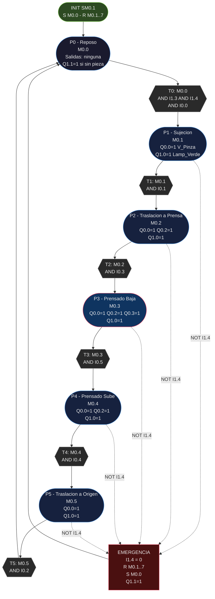

# Unidad de Procesamiento - XK335B
## Diagrama de la Red de Petri (CIPN)

---

## 1. Diagrama Mermaid

---

## 2. Tabla de Plazas

| Plaza | Address | Simbolo            | Acciones Q activas                     | Descripcion resumida                         |
|-------|---------|--------------------|----------------------------------------|----------------------------------------------|
| P0    | M0.0    | P0_Reposo          | (ninguna)                              | Sistema en espera, carro origen, pinza abierta|
| P1    | M0.1    | P1_Sujecion        | Q0.0, Q1.0                            | Pinza cierra sobre la pieza en origen        |
| P2    | M0.2    | P2_Traslacion_In   | Q0.0, Q0.2, Q1.0                      | Carro se traslada con pieza hacia la prensa  |
| P3    | M0.3    | P3_Prensado_Baja   | Q0.0, Q0.2, Q0.3, Q1.0               | Prensa desciende (operacion de prensado)     |
| P4    | M0.4    | P4_Prensado_Sube   | Q0.0, Q0.2, Q1.0                      | Prensa asciende, carro permanece en prensa   |
| P5    | M0.5    | P5_Traslacion_Out  | Q0.0, Q1.0                            | Carro retorna a origen con pieza sujeta      |

---

## 3. Tabla de Transiciones

| Trans. | Address | Simbolo           | Condicion completa                              |
|--------|---------|-------------------|-------------------------------------------------|
| T0     | M1.0    | T0_Inicio         | M0.0 AND I1.3 AND I1.4 AND I0.0               |
| T1     | M1.1    | T1_Sujeto         | M0.1 AND I0.1                                  |
| T2     | M1.2    | T2_Carro_Prensa   | M0.2 AND I0.3                                  |
| T3     | M1.3    | T3_Prensa_Abajo   | M0.3 AND I0.5                                  |
| T4     | M1.4    | T4_Prensa_Arriba  | M0.4 AND I0.4                                  |
| T5     | M1.5    | T5_Carro_Origen   | M0.5 AND I0.2                                  |

---

## 4. Tabla de Sensores por Plaza

| Plaza | Sensor de llegada | Address | Descripcion                           |
|-------|-------------------|---------|---------------------------------------|
| P0    | (marcado inicial) | -       | Activado por SM0.1 o retorno de T5   |
| P1    | I0.1              | M2.2    | Pinza cerrada confirmada              |
| P2    | I0.3              | M2.4    | Cil largo retraido = carro en prensa  |
| P3    | I0.5              | M2.5    | Cil delgado extendido = prensa abajo  |
| P4    | I0.4              | M2.6    | Cil delgado retraido = prensa arriba  |
| P5    | I0.2              | M2.3    | Cil largo extendido = carro en origen |

---

## 5. Notas del Diagrama

- Las lineas punteadas representan la ruta de emergencia que puede activarse desde cualquier plaza P1 a P5.
- La condicion de emergencia (NOT I1.4) tiene prioridad sobre cualquier estado de la red.
- Al disparar la emergencia, el marcado es forzado a P0 (R M0.1..7, S M0.0) y todas las salidas Q quedan en 0.
- El nodo INIT representa el primer ciclo de scan (SM0.1=1) que establece el marcado inicial.
- P3 esta resaltado en rojo por ser la plaza de mayor riesgo (prensa activa).
