# Diagrama Red de Petri: Unidad de Procesamiento (CIPN)
## Sistema de Manufactura Flexible XK335B | S7-200 CPU 224XP CN
### Estación 4 — Procesamiento | Versión 4.0

---

## Leyenda
- **Círculos / Óvalos** = Plazas (estados estables, portadoras de marcas M)
- **Rectángulos** = Transiciones (eventos que cambian el estado)
- **Flechas sólidas** = Flujo de marcas
- **Flechas punteadas** = Condición de emergencia
- `[Mx.y]` = Marca de memoria interna asociada

---

## Diagrama Principal

```mermaid
flowchart TD

    %% =========================================================
    %% ARRANQUE
    %% =========================================================

    INIT(["SM0.1\nPrimer Scan"]):::init

    %% =========================================================
    %% ZONA 0: REPOSO
    %% =========================================================

    P0(["P0 - Reposo\n[M0.0]\nCarro en origen\nPinza abierta, sin pieza"]):::plaza_ctrl

    INIT -->|"S M0.0\nR M0.1..7"| P0

    %% =========================================================
    %% ZONA 1: SUJECIÓN Y TRASLADO ENTRADA
    %% =========================================================

    P1(["P1 - Sujeción\n[M0.1]\nPinza cierra sobre pieza\nQ0.0=1 Q1.0=1"]):::plaza_exec
    P2(["P2 - Traslación a Prensa\n[M0.2]\nCarro se desplaza hacia la prensa\nQ0.0=1 Q0.2=1 Q1.0=1"]):::plaza_exec

    T0["T0 - Inicio Ciclo\n[M1.0]\nM0.0 AND I1.3 AND I1.4 AND I0.0\n(Marcha + Seta OK + Pieza en origen)"]:::trans
    T1["T1 - Sujeción OK\n[M1.1]\nM0.1 AND I0.1\n(Pinza cerrada I0.1)"]:::trans
    T2["T2 - Carro en Prensa\n[M1.2]\nM0.2 AND I0.3\n(Cil_Lrg retraído I0.3)"]:::trans

    P0 --> T0
    T0 -->|"R M0.0\nS M0.1"| P1
    P1 --> T1
    T1 -->|"R M0.1\nS M0.2"| P2
    P2 --> T2

    %% =========================================================
    %% ZONA 2: CICLO DE PRENSADO (riesgo alto)
    %% =========================================================

    P3(["P3 - Prensado Baja\n[M0.3]\nPistón de prensa desciende\nQ0.0=1 Q0.2=1 Q0.3=1 Q1.0=1"]):::plaza_pick
    P4(["P4 - Prensado Sube\n[M0.4]\nPistón de prensa asciende\nQ0.0=1 Q0.2=1 Q1.0=1"]):::plaza_pick

    T3["T3 - Prensa Abajo\n[M1.3]\nM0.3 AND I0.5\n(Cil_Delgado extendido I0.5)"]:::trans
    T4["T4 - Prensa Arriba\n[M1.4]\nM0.4 AND I0.4\n(Cil_Delgado retraído I0.4)"]:::trans

    T2 -->|"R M0.2\nS M0.3"| P3
    P3 --> T3
    T3 -->|"R M0.3\nS M0.4"| P4
    P4 --> T4

    %% =========================================================
    %% ZONA 3: TRASLADO DE RETORNO
    %% =========================================================

    P5(["P5 - Traslación a Origen\n[M0.5]\nCarro retorna al origen con pieza\nQ0.0=1 Q1.0=1"]):::plaza_exec

    T5["T5 - Carro en Origen\n[M1.5]\nM0.5 AND I0.2\n(Cil_Lrg extendido I0.2)"]:::trans

    T4 -->|"R M0.4\nS M0.5"| P5
    P5 --> T5
    T5 -->|"R M0.5\nS M0.0"| P0

    %% =========================================================
    %% EMERGENCIA
    %% =========================================================

    EMERG(["EMERGENCIA\nI1.4 = 0\nSeta activa"]):::emerg

    P1 -.->|"NOT I1.4"| EMERG
    P2 -.->|"NOT I1.4"| EMERG
    P3 -.->|"NOT I1.4"| EMERG
    P4 -.->|"NOT I1.4"| EMERG
    P5 -.->|"NOT I1.4"| EMERG
    EMERG -.->|"R M0.1..7\nS M0.0\nR Q0.0..Q0.3\nQ1.1=1"| P0

    %% =========================================================
    %% ESTILOS
    %% =========================================================

    classDef plaza_ctrl   fill:#1f2e24,stroke:#16a34a,stroke-width:3px,color:#c9d1d9
    classDef plaza_exec   fill:#2e2c1f,stroke:#ca8a04,stroke-width:2px,color:#c9d1d9
    classDef plaza_pick   fill:#2e251f,stroke:#ea580c,stroke-width:2px,color:#c9d1d9
    classDef trans        fill:#161b22,stroke:#475569,stroke-width:1px,color:#c9d1d9
    classDef init         fill:#1e293b,stroke:#64748b,stroke-width:1px,color:#c9d1d9,stroke-dasharray:4
    classDef emerg        fill:#450a0a,stroke:#f87171,stroke-width:3px,color:#c9d1d9
```

> **⚠ Nota de seguridad:** P3 (Prensado Baja) es la plaza de mayor riesgo operativo.
> La emergencia por I1.4 = 0 tiene prioridad absoluta y detiene el ciclo desde cualquier estado.

---

## Tabla de Plazas (referencia rápida)

| Plaza | Marca | Nombre | Descripción | Salidas Q activas |
|:---|:---|:---|:---|:---|
| **P0** | **M0.0** | **Reposo** | **Estado inicial / post-emergencia** | **(ninguna)** |
| P1 | M0.1 | Sujeción | Pinza cierra sobre la pieza en origen | Q0.0, Q1.0 |
| P2 | M0.2 | Traslación_In | Carro se desplaza con pieza hacia la prensa | Q0.0, Q0.2, Q1.0 |
| P3 | M0.3 | Prensado_Baja | ⚠ Prensa desciende (operación de prensado) | Q0.0, Q0.2, Q0.3, Q1.0 |
| P4 | M0.4 | Prensado_Sube | Prensa asciende, carro permanece en prensa | Q0.0, Q0.2, Q1.0 |
| P5 | M0.5 | Traslación_Out | Carro retorna a origen con pieza sujeta | Q0.0, Q1.0 |

---

## Tabla de Transiciones (referencia rápida)

| Transición | Marca | Condición (AWL) | Acción principal |
|:---|:---|:---|:---|
| T0 | M1.0 | M0.0 AND I1.3 AND I1.4 AND I0.0 | R M0.0, S M0.1 |
| T1 | M1.1 | M0.1 AND I0.1 | R M0.1, S M0.2 |
| T2 | M1.2 | M0.2 AND I0.3 | R M0.2, S M0.3 |
| T3 | M1.3 | M0.3 AND I0.5 | R M0.3, S M0.4 |
| T4 | M1.4 | M0.4 AND I0.4 | R M0.4, S M0.5 |
| T5 | M1.5 | M0.5 AND I0.2 | R M0.5, S M0.0 |

---

## Tabla de Sensores por Plaza (referencia rápida)

| Plaza | Sensor de llegada | Dirección | Descripción |
|:---|:---|:---|:---|
| P0 | (marcado inicial) | — | Activado por SM0.1 o retorno de T5 |
| P1 | I0.1 | M2.2 | Pinza cerrada confirmada |
| P2 | I0.3 | M2.4 | Cilindro largo retraído = carro en prensa |
| P3 | I0.5 | M2.5 | Cilindro delgado extendido = prensa abajo |
| P4 | I0.4 | M2.6 | Cilindro delgado retraído = prensa arriba |
| P5 | I0.2 | M2.3 | Cilindro largo extendido = carro en origen |

---

## Comportamiento de Emergencia

| Condición | Acción AWL | Efecto en el sistema |
|:---|:---|:---|
| I1.4 = 0 (seta pulsada) | Omite asignación de salidas | Q0.0..Q0.3 = 0 (todos los actuadores paran) |
| I1.4 = 0 en bloque EMERG | R M0.1..7, S M0.0 | Resetea todas las plazas, activa P0 (Reposo) |
| Señal Q1.1 en emergencia | NOT I1.4 en condición | Baliza roja activa |
| Recuperación | Liberar seta (I1.4 → 1) | Sistema en P0, listo para nuevo ciclo |

---

## Marcado Inicial (Primer Scan)

Condición: SM0.1 = 1 (solo el primer ciclo de scan del PLC)

| Operación | Efecto |
|:---|:---|
| S M0.0, 1 | Activa P0 (marca inicial de la Red de Petri) |
| R M0.1, 7 | Garantiza que P1..P5 estén en 0 |

El sistema siempre arranca en estado **P0 (Reposo)** con todas las salidas inactivas.
