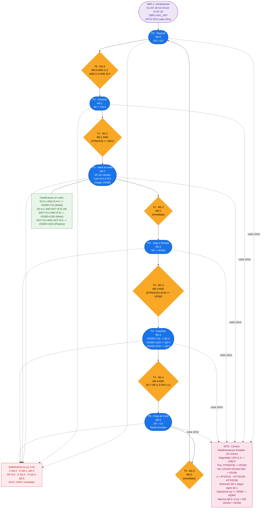

# Unidad de Seleccion - Diagrama de la Red de Petri
Sistema de Manufactura Flexible XK335B | S7-200 CPU 224XP CN

---

## 1. Diagrama Flowchart

---

## 2. Tabla de Plazas - Resumen

| Plaza | Marca | Nombre      | Setpoint VD112 | Accion Adicional                                        |
|-------|-------|-------------|----------------|---------------------------------------------------------|
| P0    | M0.0  | P0_Reposo   | 0.0            | Ninguna (cinta parada, espera inicio)                   |
| P1    | M0.1  | P1_Avanzar  | 710.0          | Cinta avanza hacia zona de sensores                     |
| P2    | M0.2  | P2_Ident    | Sin cambio     | Lee I0.4 e I0.5, carga VD300 segun clasificacion        |
| P3    | M0.3  | P3_Viaje    | VD300          | Cinta lleva pieza hasta la coordenada de la rampa       |
| P4    | M0.4  | P4_Expulsar | Sin cambio     | Activa Q0.4, Q0.5 o Q0.6 segun VD300                   |
| P5    | M0.5  | P5_Final    | 0.0            | Reset encoder: SMD38=0, HSC 0                           |

---

## 3. Tabla de Transiciones - Condiciones Exactas

| Trans. | Marca | Nombre          | Condicion AWL resumida                                   |
|--------|-------|-----------------|----------------------------------------------------------|
| T0     | M1.0  | T0_Inicio       | M0.0 AND I1.3 AND I1.4 AND I0.3                          |
| T1     | M1.1  | T1_Pos500       | M0.1 AND (DTR HC0 AR>= 490.0)                            |
| T2     | M1.2  | T2_Clasificado  | M0.2 (sin condicion extra, disparo en siguiente scan)    |
| T3     | M1.3  | T3_Target       | M0.3 AND (DTR HC0 +R 10.0 AR>= VD300)                   |
| T4     | M1.4  | T4_Push_OK      | M0.4 AND (I0.7 OR I1.0 OR I1.1)                          |
| T5     | M1.5  | T5_Fin_Ciclo    | M0.5 (sin condicion extra, disparo en siguiente scan)    |

---

## 4. Tabla de Coordenadas de Rampa

| Material     | I0.5 | I0.4 | VD300 (cuentas) | Cilindro | Salida |
|--------------|------|------|-----------------|----------|--------|
| Metal puro   | 1    | 1    | 710.0           | Rampa 1  | Q0.4   |
| Mixto        | 1    | 0    | 1150.0          | Rampa 2  | Q0.5   |
| Mixto        | 0    | 1    | 1150.0          | Rampa 2  | Q0.5   |
| Plastico     | 0    | 0    | 1520.0          | Rampa 3  | Q0.6   |

---

## 5. Parametros del Controlador

| Parametro | Variable | Valor  | Descripcion                                      |
|-----------|----------|--------|--------------------------------------------------|
| K1        | VD120    | 97.26  | Ganancia de realimentacion de posicion           |
| K2        | VD124    | 25.64  | Ganancia de realimentacion de velocidad          |
| N         | VD132    | 97.26  | Ganancia de pre-compensacion de referencia       |
| Ts        | SMB34    | 10 ms  | Periodo de muestreo (interrupcion temporizada)   |
| Sat. max  | -        | 32000  | Saturacion de la accion de control (= 10 V)      |
| Zona muerta| -       | 100    | Umbral minimo de accion para activar motor       |
