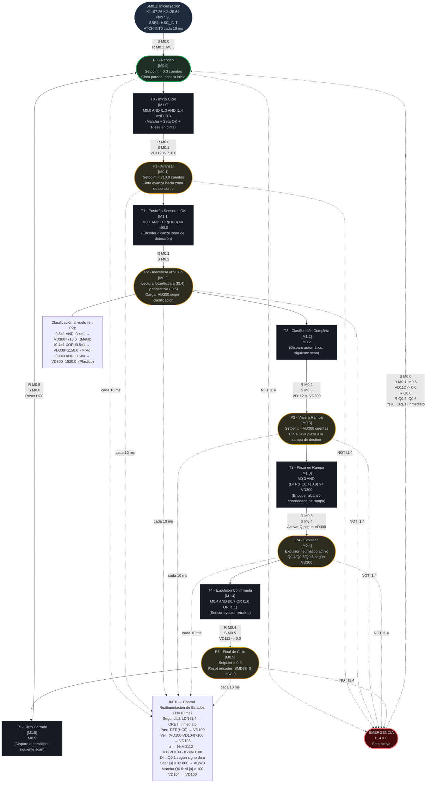
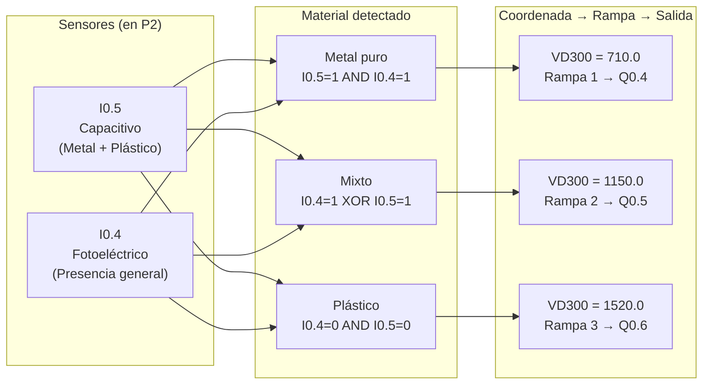

# Diagrama Red de Petri: Unidad de Selección (CIPN)
## Sistema de Manufactura Flexible XK335B | S7-200 CPU 224XP CN
### Estación 5 — Selección | Versión 4.0

---

## Leyenda
- **Círculos / Óvalos** = Plazas (estados estables, portadoras de marcas M)
- **Rectángulos** = Transiciones (eventos que cambian el estado)
- **Flechas sólidas** = Flujo de marcas
- **Flechas punteadas** = Condición de emergencia o lazo de control
- `[Mx.y]` = Marca de memoria interna asociada

---

## Diagrama Principal

---

## Mapa de Clasificación al Vuelo

---

## Tabla de Plazas (referencia rápida)

| Plaza | Marca | Nombre | Setpoint VD112 | Descripción |
|:---|:---|:---|:---|:---|
| **P0** | **M0.0** | **Reposo** | **0.0** | **Estado inicial / post-emergencia** |
| P1 | M0.1 | Avanzar | 710.0 | Cinta avanza hacia zona de sensores |
| P2 | M0.2 | Identificar | Sin cambio | Lee I0.4 e I0.5, carga VD300 según clasificación |
| P3 | M0.3 | Viaje | VD300 | Cinta lleva pieza hasta la coordenada de la rampa |
| P4 | M0.4 | Expulsar | Sin cambio | Activa Q0.4, Q0.5 o Q0.6 según VD300 |
| P5 | M0.5 | Final | 0.0 | Reset encoder: SMD38=0, HSC 0 |

---

## Tabla de Transiciones (referencia rápida)

| Transición | Marca | Condición (AWL) | Acción principal |
|:---|:---|:---|:---|
| T0 | M1.0 | M0.0 AND I1.3 AND I1.4 AND I0.3 | R M0.0, S M0.1, VD112←710.0 |
| T1 | M1.1 | M0.1 AND (DTR HC0 AR>= 490.0) | R M0.1, S M0.2 |
| T2 | M1.2 | M0.2 (automático, siguiente scan) | R M0.2, S M0.3, VD112←VD300 |
| T3 | M1.3 | M0.3 AND (DTR HC0 +R 10.0 AR>= VD300) | R M0.3, S M0.4, Activar eyector |
| T4 | M1.4 | M0.4 AND (I0.7 OR I1.0 OR I1.1) | R M0.4, S M0.5, VD112←0.0 |
| T5 | M1.5 | M0.5 (automático, siguiente scan) | R M0.5, S M0.0, Reset HC0 |

---

## Tabla de Coordenadas de Rampa

| Material | I0.5 | I0.4 | VD300 (cuentas) | Cilindro | Salida |
|:---|:---:|:---:|:---|:---|:---|
| Metal puro | 1 | 1 | 710.0 | Rampa 1 | Q0.4 |
| Mixto | 1 | 0 | 1150.0 | Rampa 2 | Q0.5 |
| Mixto | 0 | 1 | 1150.0 | Rampa 2 | Q0.5 |
| Plástico | 0 | 0 | 1520.0 | Rampa 3 | Q0.6 |

---

## Parámetros del Controlador de Estados

| Parámetro | Variable | Valor | Descripción |
|:---|:---|:---|:---|
| K1 | VD120 | 97.26 | Ganancia de realimentación de posición |
| K2 | VD124 | 25.64 | Ganancia de realimentación de velocidad |
| N | VD132 | 97.26 | Ganancia de pre-compensación de referencia |
| Ts | SMB34 | 10 ms | Período de muestreo (interrupción temporizada) |
| Sat. máx | — | 32 000 | Saturación de la acción de control (= 10 V) |
| Zona muerta | — | 100 | Umbral mínimo de acción para activar motor |

---

## Comportamiento de Emergencia

| Condición | Acción AWL | Efecto en el sistema |
|:---|:---|:---|
| I1.4 = 0 (seta pulsada) | INT0: CRETI inmediato | Lazo de control se detiene al instante |
| I1.4 = 0 en bloque EMERG | S M0.0, R M0.1..M0.5 | Resetea todas las plazas, activa P0 (Reposo) |
| VD112 en emergencia | VD112 ← 0.0 | Setpoint a cero: cinta se frena |
| Eyectores en emergencia | R Q0.4..Q0.6 | Todos los cilindros se retraen |
| Recuperación | Liberar seta (I1.4 → 1) | Sistema en P0, listo para nuevo ciclo |
