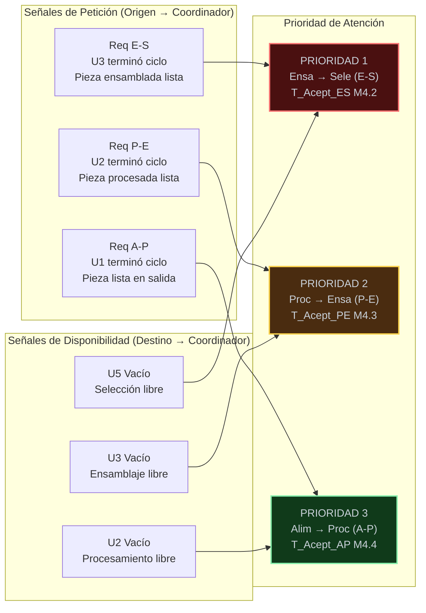

# Diagrama Red de Petri General: Sistema Integrado de Manufactura (CIPN)
## Sistema de Manufactura Flexible XK335B | S7-200 CPU 224XP CN
### Coordinación Global — Versión 4.0

---

## Leyenda
- **Círculos / Óvalos** = Plazas (estados estables, portadoras de marcas M)
- **Rectángulos** = Transiciones (eventos que cambian el estado)
- **Flechas sólidas** = Flujo de marcas interno a cada estación
- **Flechas etiquetadas** = Señales de sincronización inter-PLC (handshake vía red PPI/Modbus)
- La **Unidad de Transporte (U4)** actúa como coordinador central del flujo de piezas

---

## Diagrama de Coordinación Global

```mermaid
flowchart TD

    %% =========================================================
    %% UNIDAD DE ALIMENTACIÓN — Estación 2
    %% =========================================================

    subgraph U1["Estación 2 — Alimentación"]
        U1_P0(["U1: Reposo\n[M0.0]\nEspera pieza en base"]):::plaza_ctrl
        U1_P1(["U1: Proceso\n[M0.1..M0.4]\nCiclo de dosificación activo"]):::plaza_exec
        U1_P2(["U1: Espera Recogida\n[Req A-P]\nPieza disponible en salida"]):::plaza_req

        U1_T0["T: Iniciar Dosificación\nM2.0 AND M2.1\n(Marcha + Pieza en base)"]:::trans
        U1_T1["T: Pieza Disponible\nM2.5 (Cil_Peq_Ret)\n(Ciclo completo)"]:::trans
        U1_T_Hand["T: Brazo Recoge U1\n(Señal del Coordinador)"]:::trans

        U1_P0 --> U1_T0
        U1_T0 -->|"S M0.1"| U1_P1
        U1_P1 --> U1_T1
        U1_T1 -->|"S Req_AP\nS M0.0"| U1_P2
        U1_P2 --> U1_T_Hand
        U1_T_Hand -->|"R Req_AP"| U1_P0
    end

    %% =========================================================
    %% UNIDAD DE PROCESAMIENTO — Estación 4
    %% =========================================================

    subgraph U2["Estación 4 — Procesamiento"]
        U2_P0(["U2: Vacío\n[M0.0]\nListo para recibir pieza"]):::plaza_ctrl
        U2_P1(["U2: Proceso\n[M0.1..M0.5]\nCiclo de prensado activo"]):::plaza_exec
        U2_P2(["U2: Espera Recogida\n[Req P-E]\nPieza procesada disponible"]):::plaza_req

        U2_T_In["T: Brazo Deposita U2\n(Señal del Coordinador)"]:::trans
        U2_T1["T: Proceso OK\nM1.5 (Carro en origen)\n(Ciclo completo)"]:::trans
        U2_T_Out["T: Brazo Recoge U2\n(Señal del Coordinador)"]:::trans

        U2_P0 --> U2_T_In
        U2_T_In -->|"S M0.1"| U2_P1
        U2_P1 --> U2_T1
        U2_T1 -->|"S Req_PE\nS M0.0"| U2_P2
        U2_P2 --> U2_T_Out
        U2_T_Out -->|"R Req_PE"| U2_P0
    end

    %% =========================================================
    %% UNIDAD DE ENSAMBLAJE — Estación 3
    %% =========================================================

    subgraph U3["Estación 3 — Ensamblaje"]
        U3_P0(["U3: Vacío\n[M0.0]\nListo para recibir pieza"]):::plaza_ctrl
        U3_P1(["U3: Proceso\n[M0.1..M1.4]\nCiclo de ensamblaje activo"]):::plaza_exec
        U3_P2(["U3: Espera Recogida\n[Req E-S]\nPieza ensamblada disponible"]):::plaza_req

        U3_T_In["T: Brazo Deposita U3\n(Señal del Coordinador)"]:::trans
        U3_T1["T: Ensamblaje OK\nM5.4 (Reset_Arm)\n(Ciclo completo)"]:::trans
        U3_T_Out["T: Brazo Recoge U3\n(Señal del Coordinador)"]:::trans

        U3_P0 --> U3_T_In
        U3_T_In -->|"S M0.1"| U3_P1
        U3_P1 --> U3_T1
        U3_T1 -->|"S Req_ES\nS M0.0"| U3_P2
        U3_P2 --> U3_T_Out
        U3_T_Out -->|"R Req_ES"| U3_P0
    end

    %% =========================================================
    %% UNIDAD DE SELECCIÓN — Estación 5
    %% =========================================================

    subgraph U5["Estación 5 — Selección"]
        U5_P0(["U5: Vacío\n[M0.0]\nListo para recibir pieza"]):::plaza_ctrl
        U5_P1(["U5: Clasificación\n[M0.1..M0.5]\nCiclo de selección activo"]):::plaza_exec

        U5_T_In["T: Brazo Deposita U5\n(Señal del Coordinador)"]:::trans
        U5_T1["T: Clasificación OK\nM1.5 (Fin Ciclo)\n(Ciclo completo)"]:::trans

        U5_P0 --> U5_T_In
        U5_T_In -->|"S M0.1"| U5_P1
        U5_P1 --> U5_T1
        U5_T1 -->|"S M0.0"| U5_P0
    end

    %% =========================================================
    %% COORDINADOR DE TRANSPORTE — Estación 1 (eje central)
    %% =========================================================

    subgraph U4["Estación 1 — Transporte (Coordinador)"]
        U4_P0(["Brazo Libre\n[M0.0]\nReposo, listo para tarea"]):::plaza_ctrl

        U4_T_AP["T: Atender A-P\n[M4.4] PRIORIDAD 3\nM0.0 AND Req_AP AND U2_Vacio"]:::trans_prio3
        U4_T_PE["T: Atender P-E\n[M4.3] PRIORIDAD 2\nM0.0 AND Req_PE AND U3_Vacio AND !Req_ES"]:::trans_prio2
        U4_T_ES["T: Atender E-S\n[M4.2] PRIORIDAD 1\nM0.0 AND Req_ES AND U5_Vacio"]:::trans_prio1

        U4_P_Exec(["Ejecutando Tarea\n[M1.0..M3.6]\nPick + Viaje + Place en curso"]):::plaza_exec

        U4_T_Done["T: Tarea Finalizada\n[M6.7]\nM3.6 (Secuencia Place completa)"]:::trans

        U4_P0 --> U4_T_AP
        U4_P0 --> U4_T_PE
        U4_P0 --> U4_T_ES
        U4_T_AP -->|"S M1.0\nS M7.0"| U4_P_Exec
        U4_T_PE -->|"S M1.0\nS M7.1"| U4_P_Exec
        U4_T_ES -->|"S M1.0\nS M7.2"| U4_P_Exec
        U4_P_Exec --> U4_T_Done
        U4_T_Done -->|"S M0.0\nR M7.x\nR Solicitud"| U4_P0
    end

    %% =========================================================
    %% SINCRONIZACIÓN (Handshakes inter-PLC)
    %% =========================================================

    U1_P2 -->|"Req A-P\n(red PPI/Modbus)"| U4_T_AP
    U2_P0 -->|"U2 Vacío\n(red PPI/Modbus)"| U4_T_AP
    U4_T_AP -->|"Drop U2\n(confirmación)"| U2_T_In

    U2_P2 -->|"Req P-E\n(red PPI/Modbus)"| U4_T_PE
    U3_P0 -->|"U3 Vacío\n(red PPI/Modbus)"| U4_T_PE
    U4_T_PE -->|"Drop U3\n(confirmación)"| U3_T_In

    U3_P2 -->|"Req E-S\n(red PPI/Modbus)"| U4_T_ES
    U5_P0 -->|"U5 Vacío\n(red PPI/Modbus)"| U4_T_ES
    U4_T_ES -->|"Drop U5\n(confirmación)"| U5_T_In

    %% =========================================================
    %% ESTILOS
    %% =========================================================

    classDef plaza_ctrl   fill:#1f2e24,stroke:#16a34a,stroke-width:3px,color:#c9d1d9
    classDef plaza_req    fill:#1f282e,stroke:#0284c7,stroke-width:2px,color:#c9d1d9
    classDef plaza_exec   fill:#2e2c1f,stroke:#ca8a04,stroke-width:2px,color:#c9d1d9
    classDef trans        fill:#161b22,stroke:#475569,stroke-width:1px,color:#c9d1d9
    classDef trans_prio1  fill:#4a1010,stroke:#f87171,stroke-width:2px,color:#c9d1d9
    classDef trans_prio2  fill:#4a2c10,stroke:#fcd34d,stroke-width:2px,color:#c9d1d9
    classDef trans_prio3  fill:#103a1a,stroke:#86efac,stroke-width:2px,color:#c9d1d9
```

---

## Protocolo de Coordinación (Handshake inter-PLC)

---

## Tabla de Estaciones (referencia rápida)

| Estación | Unidad | Rol | Plaza de Reposo | Plaza de Espera | Señal de Solicitud |
|:---|:---|:---|:---|:---|:---|
| Est. 1 | U4 — Transporte | Coordinador central | M0.0 Brazo Libre | — | — |
| Est. 2 | U1 — Alimentación | Origen del flujo | M0.0 Reposo | Req A-P | Pieza disponible → U4 |
| Est. 4 | U2 — Procesamiento | Estación intermedia 1 | M0.0 Vacío | Req P-E | Pieza procesada → U4 |
| Est. 3 | U3 — Ensamblaje | Estación intermedia 2 | M0.0 Vacío | Req E-S | Pieza ensamblada → U4 |
| Est. 5 | U5 — Selección | Destino final | M0.0 Vacío | — | Fin de proceso |

---

## Reglas de Coordinación

El Coordinador de Transporte (U4) solo dispara un traslado si se cumplen **simultáneamente** las tres condiciones siguientes:

| Condición | Verificación |
|:---|:---|
| **Brazo libre** | M0.0 activo en U4 (Brazo Libre) |
| **Origen con pieza** | Plaza de "Espera Recogida" activa en la estación origen |
| **Destino vacío** | Plaza "Vacío" activa en la estación destino |

En caso de múltiples solicitudes simultáneas, el sistema resuelve el conflicto por **prioridad fija descendente**: E-S > P-E > A-P. Esto garantiza que la línea no se bloquee por acumulación en las estaciones de mayor valor añadido.
