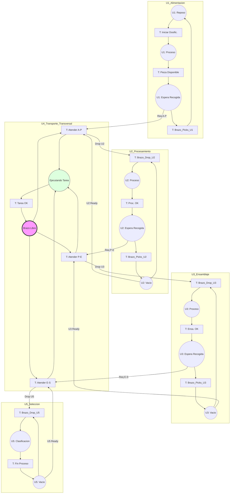

# Diagrama de Red de Petri General: Sistema Integrado de Manufactura

Este diagrama visualiza la coordinacion global de la planta, donde la **Unidad de Transporte** actua como el eje transversal que gestiona el flujo de piezas entre las estaciones periféricas.

## Mecanismo de Interacción
1. **Petición (Request):** Una estación pone una marca en su plaza de "Espera Recogida" cuando termina su proceso interno. Esta marca viaja por red (NetW) hacia el PLC de Transporte.
2. **Disponibilidad (Ready):** Una estación pone una marca en "Vacío" cuando no tiene piezas y está lista para recibir una nueva.
3. **Ejecución:** El Coordinador de Transporte solo dispara un traslado si el Origen está listo Y el Destino está vacío Y el Brazo está libre.
4. **Finalización:** Tras el "Drop" (entrega), el Brazo envía un pulso de confirmación para que la estación de destino inicie su ciclo local.
