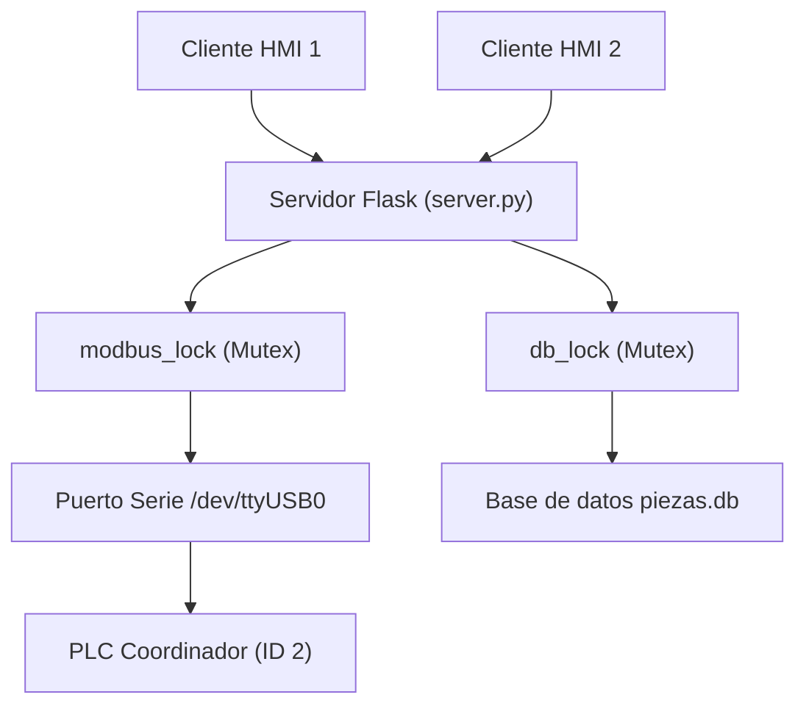

# Manual de Aprendizaje e Integracion - Planta XK-335B

Este documento ha sido disenado como una guia de estudio y manual de ingenieria para aquellos que deseen comprender, replicar o extender el control de la planta de manufactura flexible XK-335B y su integracion con el sistema SCADA HMI.

---

## Modulo 0: Contexto General de la Planta Flexible XK-335B

La planta de manufactura flexible XK-335B simula una linea automatizada de procesamiento de piezas compuesta por 5 estaciones de trabajo independientes coordinadas en red:

1.  **Estacion 1 - Transporte (Coordinador Central - Carpeta [1_Transporte](file:///media/gabriel/ing/ETN1034/Laboratorio%20final/1_Transporte)):** Se encarga de trasladar fisicamente las piezas entre las demas estaciones usando un carro con servomotor lineal (controlado por pulsos PTO) y pinzas neumaticas.
    *   *Posiciones del Servo (VD10 a VD22 en el PLC):* Alimentacion (8000), Procesamiento (50000), Ensamblaje (92000) y Seleccion (112000).
2.  **Estacion 2 - Alimentacion (Carpeta [2_Alimentacion](file:///media/gabriel/ing/ETN1034/Laboratorio%20final/2_Alimentacion)):** Dosifica y distribuye las piezas de materia prima (cuerpos metalicos, mixtos o plasticos) hacia el sistema de transporte.
3.  **Estacion 3 - Ensamblaje (Carpeta [3_Ensamblaje](file:///media/gabriel/ing/ETN1034/Laboratorio%20final/3_Ensamblaje)):** Procesa y monta las tapas superiores en los cuerpos de las piezas recibidas.
4.  **Estacion 4 - Procesamiento (Carpeta [4_Procesamiento](file:///media/gabriel/ing/ETN1034/Laboratorio%20final/4_Procesamiento)):** Simula un proceso de taladrado y pulido de piezas mediante actuadores neumaticos y motores de corriente continua.
5.  **Estacion 5 - Seleccion (Carpeta [5_Seleccion](file:///media/gabriel/ing/ETN1034/Laboratorio%20final/5_Seleccion)):** Clasifica el producto terminado en rampas distintas segun el material detectado por sus sensores (Metalica, Mixta o Plastica).

*   *Para profundizar en el flujo secuencial de cada estacion, su hardware y sus variables fisicas, revisa los archivos `1_Comprension_Proceso.md` y `2_Mapeo_Hardware.md` dentro de la carpeta correspondiente a cada unidad.*

---

## Modulo 1: Modelado de Sistemas Secuenciales con Redes de Petri

### 1.1 El Problema del Ladder Tradicional (Efecto Avalancha)
En sistemas de manufactura complejos, la programacion en diagrama de contactos (Ladder) convencional basada en bobinas auxiliares auto-retenidas suele presentar problemas de carreras criticas y el denominado **efecto avalancha**. 
*   **¿Que es el efecto avalancha?** Ocurre cuando, durante un mismo ciclo de escaneo del PLC, la activacion de una etapa activa inmediatamente la siguiente porque las condiciones logicas se evaluan de arriba hacia abajo de forma secuencial. Esto provoca que el PLC "salte" multiples pasos en un solo milisegundo, arruinando la secuencia fisica.
*   **La Solucion:** Utilizar un modelado formal de estados independientes. Las **Redes de Petri Interpretadas por Control (CPN)** resuelven esto separando la logica de habilitacion de la logica de accion.

### 1.2 Fundamentos de las Redes de Petri
Una Red de Petri esta compuesta por:
1.  **Lugares (Places - P):** Representan estados o etapas del proceso (ej. "Cilindro A extendido", "Motor en marcha"). Se representan graficamente como circulos y contienen marcas (tokens) para indicar que el estado esta activo.
2.  **Transiciones (T):** Representan los eventos o condiciones necesarias para cambiar de estado (ej. "Sensor de fin de carrera activo AND boton de marcha presionado"). Se representan como barras.
3.  **Arcos Dirigidos:** Conectan Lugares con Transiciones (arcos de entrada) y Transiciones con Lugares (arcos de salida).

### 1.3 Regla de Evolucion de la Red
Una transicion esta **habilitada** si todos sus lugares de origen contienen al menos una marca. Se **dispara** (ejecuta) si esta habilitada y se cumple su evento asociado. Al dispararse, remueve la marca de sus lugares de origen e introduce una marca en sus lugares de destino.

*   *Recurso recomendado para ver el modelado global:* [DIAGRAMA_GENERAL_INTEGRADO.md](file:///media/gabriel/ing/ETN1034/Laboratorio%20final/DIAGRAMA_GENERAL_INTEGRADO.md)

---

## Modulo 2: Metodologia de Traduccion "Petri-to-Ladder" Determinista

Para programar una Red de Petri en el PLC S7-200 garantizando atomicidad y evitando el efecto avalancha, se utiliza el metodo de la **Ecuacion de Estado**.

### 2.1 Mapeo de Variables en el PLC
*   **Lugares ($P_x$):** Se asignan a bits de marcas internas estables del PLC (ej. `V100.0`, `V100.1` o marcas `M`).
*   **Transiciones ($T_x$):** Se asignan a variables temporales de ciclo (ej. marcas locales `L` o variables de ciclo `M` reservadas) que solo se activan por un instante durante la evaluacion.

### 2.2 Algoritmo de dos fases (Escaneo Seguro)
El programa del PLC debe estructurarse en cada ciclo de escaneo en dos fases estrictas:

#### Fase 1: Evaluacion de Transiciones
Se calculan cuales transiciones se van a disparar en este ciclo, sin alterar todavia el estado de los lugares.
*   *Condicion:* El lugar de origen debe estar activo (`LD Lugar_Origen`) **AND** las condiciones fisicas deben cumplirse (`A Sensor_Trigger`).
*   *Ejemplo en codigo STL (Instrucciones):*
    ```pascal
    Network 1 // Evaluacion de Transicion 1 (T1)
    LD    V100.0      // Lugar de origen (P0: Reposo)
    A     I0.0        // Condicion fisica (Boton Marcha)
    =     M0.1        // Transicion temporal (T1)
    ```

#### Fase 2: Ejecucion y Actualizacion de Marcas (Atomicidad)
Una vez evaluadas todas las transiciones del ciclo, se modifican los lugares (Set/Reset) usando las transiciones temporales calculadas en la Fase 1.
*   *Accion:* Si una transicion se disparo, se pone en 1 el lugar de destino y en 0 el lugar de origen.
*   *Ejemplo en codigo STL:*
    ```pascal
    Network 2 // Disparo de T1: Pasa de P0 a P1
    LD    M0.1        // Transicion T1 activa
    S     V100.1, 1   // Activar Lugar de destino (P1: Cilindro extendiendo)
    R     V100.0, 1   // Desactivar Lugar de origen (P0: Reposo)
    ```

*   *Recurso metodologico completo:* [petri2ladder.md](file:///media/gabriel/ing/ETN1034/Laboratorio%20final/petri2ladder.md)
*   *Ejemplos reales de programacion:* Revisa los archivos `.awl` exportados dentro de la carpeta de cualquier estacion (ej. [4_Traduccion_Ladder.awl](file:///media/gabriel/ing/ETN1034/Laboratorio%20final/1_Transporte/4_Traduccion_Ladder.awl)).

---

## Modulo 3: Comunicacion Industrial en Red (NETR/NETW)

La planta flexible XK-335B trabaja de manera distribuida. El PLC Coordinador Central (Estacion 1 - Transporte) gestiona el flujo global del proceso y se comunica con los otros 4 PLCs mediante marcas de red en el Puerto 0.

### 3.1 Instrucciones de Red S7-200
*   **NETR (Network Read):** Lee un bloque de bytes de la memoria del PLC esclavo y lo almacena en su propia memoria.
*   **NETW (Network Write):** Escribe un bloque de bytes desde su propia memoria hacia el PLC esclavo.

### 3.2 Protocolo de Handshake (Apretón de Manos)
Para asegurar que una estacion no inicie su ciclo antes de que la pieza llegue, o que el carro de transporte no retire una pieza que aun esta en proceso, se establece una logica de senales cruzadas:

1.  **Peticion de Servicio (Request):** La estacion esclava le avisa al coordinador que requiere atencion (ej. "Estacion de Alimentacion con pieza lista para ser trasladada").
2.  **Autorizacion (Grant):** El coordinador valida que el carro este en posicion y le escribe a la estacion esclava la orden de inicio.
3.  **Fin de Ciclo (Done):** La estacion esclava realiza su secuencia y, al terminar, le notifica al coordinador para que este retire la pieza o continue con la secuencia.

*   *Mapa de registros y variables de red:* [Mapeo_Memoria_Compartida.csv.txt](file:///media/gabriel/ing/ETN1034/Laboratorio%20final/Mapeo_Memoria_Compartida.csv.txt).

---

## Modulo 4: Desarrollo SCADA Multicliente y Concurrente

El SCADA interactua con el PLC Coordinador en tiempo real y debe soportar peticiones concurrentes de multiples operadores a la vez, garantizando seguridad y registro inalterable de datos.



### 4.1 Modbus RTU en Escenarios Concurrentes
El PLC actua como esclavo Modbus RTU sobre una conexion serie fisica RS-485 (semiduplex). Dado que la conexion serie solo permite transmitir un mensaje a la vez, el servidor Python utiliza:
1.  **Lock de Puerto (`modbus_lock = threading.Lock()`):** Asegura que si dos clientes hacen click en un boton de "Marcha" al mismo tiempo, las tramas Modbus se encolen y se transmitan de forma secuencial, evitando la corrupcion de datos en el bus serie.
2.  **Lectura por Bloques:** En lugar de leer registro por registro, el backend lee un bloque contiguo de 19 registros holding de una sola vez (`instrumento.read_registers(0, 19)`). Esto optimiza el tiempo de ciclo en el bus de 400ms a menos de 50ms.

### 4.2 Arquitectura Web Multihilo y SQLite
Flask corre por defecto con soporte multihilo (`threaded=True`). Esto significa que cada cliente web es atendido en un hilo de ejecucion independiente.
*   **Problema de SQLite:** SQLite por defecto bloquea la base de datos durante las operaciones de escritura. Si un hilo escribe un log de auditoria mientras otro lee las estadisticas de piezas, puede ocurrir el error `database is locked`.
*   **Soluciones implementadas:**
    *   **Lock de Base de Datos (`db_lock = threading.Lock()`):** Garantiza exclusion mutua en los hilos de Python que acceden al archivo de base de datos.
    *   **Timeout extendido:** Se configuro `sqlite3.connect(DB_PATH, timeout=10.0)` para que, si la base de datos esta ocupada, el hilo espere hasta 10 segundos antes de lanzar una excepcion.

---

## Modulo 5: Seguridad SCADA y Cumplimiento Normativo (CFR 21 Parte 11)

En la industria de la automatizacion, los sistemas SCADA de control deben cumplir con normas de trazabilidad como la **FDA 21 CFR Part 11**.

### 5.1 Control de Acceso Basado en Roles (RBAC)
El sistema implementa dos roles de usuario para limitar las acciones de riesgo:
*   **Operador:** Autorizado unicamente a iniciar secuencias globales o individuales de marcha y parada.
*   **Ingeniero:** Acceso completo, incluyendo la modificacion de las consignas de coordenadas fisicas de posicionamiento del servomotor (`VD10` a `VD22`).

*La verificacion se realiza en el backend mediante cabeceras HTTP (`X-User-Role` y `X-Username`) validadas en cada llamada a las APIs de escritura.*

### 5.2 Registro de Auditoria (Audit Trail)
Todas las acciones críticas realizadas por los usuarios son registradas en la tabla `registro_auditoria` con marca de tiempo del servidor, usuario responsable, tipo de accion y detalle de los parametros modificados. Los tipos de eventos auditados son:
*   `INICIO_SESION` / `INICIO_SESION_FALLIDO` / `CIERRE_SESION`
*   `CAMBIO_CONSIGNA` (Ej. Modificacion de posicion de la guia lineal)
*   `MARCHA_ESTACION` / `MARCHA_GLOBAL` / `PARO_GLOBAL`
*   `EMERGENCIA_ACTIVA` / `EMERGENCIA_LIBERADA` (Alarmas de seguridad)
*   `ALARMA_TIMEOUT` (Perdida de comunicacion serie con el hardware)

### 5.3 Logica de Interlock de Seguridad
La seguridad fisica de la planta depende de la **Seta de Emergencia (NC - Normalmente Cerrada)** conectada a la entrada digital fisica `I2.6` del PLC (Modbus Discrete Input Direccion 22).
*   Si la Seta es presionada, la senal cae a `0`.
*   El servidor SCADA detecta esto en su hilo de polling ciclico, actualiza su cache global y bloquea las llamadas a todas las APIs de control retornando un codigo de estado `400 Bad Request` y registrando el evento `ESCRITURA_BLOQUEADA` en la base de datos de auditoria. Esto actua como un interlock redundante por software.
