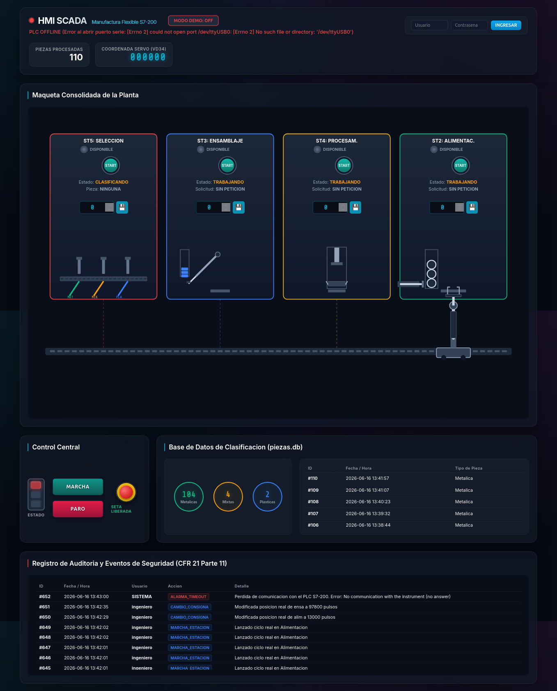

# Planta XK-335B - Laboratorio Final de Automatizacion (ETN1034)

Este proyecto contiene la integracion y el control de la planta de manufactura flexible XK-335B, incluyendo los programas de control para 5 estaciones PLC S7-200 y un sistema SCADA HMI multiplataforma desarrollado en Flask y JavaScript para el monitoreo, control de consignas y gestion de seguridad.



---

## 1. Estructura del Proyecto

*   **DOCUMENTACION_GENERAL.md**: Manual de aprendizaje e integracion detallado. Recomendado para profundizar en la teoria de control (Redes de Petri), la metodologia Petri-to-Ladder, la comunicacion de red inter-PLC y la arquitectura multihilo del SCADA.
*   **1_Transporte/ a 5_Seleccion/**: Contiene los programas de control para cada una de las 5 estaciones del proceso. Cada carpeta incluye:
    *   Proyecto ejecutable de Step 7-Micro/WIN (`.mwp`).
    *   Codigo exportado en texto plano (`.awl`) para lectura en cualquier sistema operativo.
    *   Tabla de simbolos/variables (`.csv`).
    *   Documentacion del diseno en Red de Petri.
*   **scada/**: Servidor de backend en Python (Flask API) y frontend HMI Web en HTML/CSS/JS.
*   **DIAGRAMA_GENERAL_INTEGRADO.md**: Logica y secuencia de handshake global de la planta.
*   **Mapeo_Memoria_Compartida.csv.txt**: Direccionamiento de red para la transferencia de datos entre estaciones (NETR/NETW).
*   **petri2ladder.md**: Guia y convenciones aplicadas para la traduccion de redes de Petri a lenguaje Ladder.

---

## 2. Replicacion e Instalacion del SCADA

### Requisitos Previos:
*   Python 3.8 o superior.
*   Adaptador / Conversor USB a RS-485.

### Paso 1: Clonar el proyecto y acceder a la carpeta del SCADA
```bash
cd "Laboratorio final/scada"
```

### Paso 2: Crear e iniciar el entorno virtual de Python
*   **En Linux / macOS:**
    ```bash
    python3 -m venv venv
    source venv/bin/activate
    ```
*   **En Windows (Command Prompt):**
    ```cmd
    python -m venv venv
    call venv\Scripts\activate.bat
    ```

### Paso 3: Instalar las dependencias de Python
```bash
pip install -r requirements.txt
```

### Paso 4: Iniciar el servidor SCADA
```bash
python server.py
```
Acceder en el navegador web a: `http://localhost:5000`

---

## 3. Consideraciones Importantes de Replicabilidad

### A. Configuracion del Puerto Serie (RS-485) segun el Sistema Operativo
En el archivo `scada/server.py` se define el puerto de conexion fisica con el PLC:
```python
PUERTO = '/dev/ttyUSB0'
```
Debes modificar esta linea segun tu sistema operativo:
*   **Linux:** `/dev/ttyUSB0` o `/dev/ttyUSB1` (segun el puerto detectado).
*   **Windows:** `'COM3'`, `'COM4'`, etc. (puedes verificarlo en el Administrador de Dispositivos).
*   **macOS:** `/dev/tty.usbserial-*` o `/dev/cu.usbserial-*`.

### B. Compatibilidad de los Archivos de Programacion del PLC
*   Los archivos `.mwp` pertenecen a **Step 7-Micro/WIN** (Siemens). Este software es legacy y solo funciona bajo entorno **Windows**.
*   Si utilizas Linux o macOS, puedes visualizar, auditar y estudiar el codigo Ladder de forma integra abriendo los archivos `.awl` con cualquier editor de texto plano (como VS Code, Sublime Text, etc.).

### C. Parametros requeridos en el PLC Maestro (ID 2)
Para la conexion fisica y la logica de seguridad, la configuracion de la instruccion `MBUS_INIT` en el PLC Coordinador (Transporte) debe ser:
*   `MaxHold`: `40` (o superior) para mapear el area de variables de intercambio.
*   `MaxIQ`: `24` (o superior) para permitir la lectura del bit 22 (Entrada fisica `I2.6` de la Seta de Emergencia).
